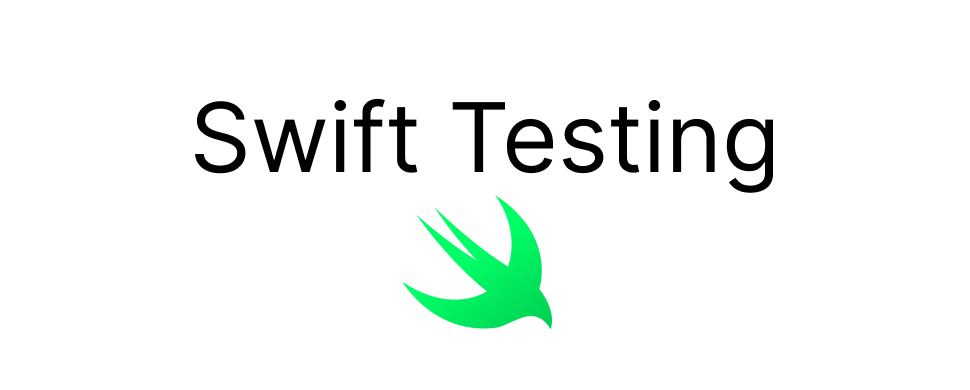

# Other

## 配图

## 自我介绍

大家好，我叫 Zac ，是一个工作了 10 年的软件工程师。之前在字节工作了 5 年，目前在韩国首尔一家互联网电商公司工作。目标是到 40 岁做一个可以养活自己的独立开发者。

## 审核介绍

Dylan Yang，iOS 开发者，目前就职于字节跳动国际化社区部门，业务爱好二次元 & 游戏。

## 文章简介

Swift Testing 是 Swift 团队推出的一个全新的测试框架，集合了原生、开源、跨平台、高效、易用、IDE 无缝集成等新特性。文章从 0 开始介绍如何使用 Swift Testing ，对比了与 XCTest 的差异，最后对 Swift Testing 以及单元测试的相关问题进行了探讨。
