# Session 10104 - 使用 RealityKit 构建空间绘画 App

本文基于[Session 10104](https://developer.apple.com/videos/play/wwdc2024/10104/)梳理。

[RealityKit](https://developer.apple.com/documentation/realitykit) 提供高性能的 3D 模拟和渲染功能，通过利用 [ARKit](https://developer.apple.com/documentation/arkit)，将虚拟对象集成到现实世界中。可用于创建 iOS、iPadOS 和 macOS 的增强现实(AR)应用，以及 visionOS 应用等。在 visionOS 上，RealityKit 是应用空间功能的基础。

在本 Session 中，我们将以[空间绘画 App](https://developer.apple.com/documentation/RealityKit/creating-a-spatial-drawing-app-with-realitykit#Configure-the-sample-code-project)为例，介绍 RealityKit 的全新功能。通过使用 RealityKit，配合 SwiftUl，打造炫目的空间体验。


我们会探索资源在 RealityKit 中的运作方式，通过构建自定义网格、纹理和着色器、使用低级别网格和纹理 API 等，实现精致的视觉设计。以下为示例项目所包含的功能：

|  |  |  |
| ------------------------------------------------------------ | --------------------------------------------------------- | ------------------------------------------------------ |

1. 如上左 1 图所示，当用户启动 App 后，会看到独特的启动画面，接着需要用户进行画布位置的设置；
2. 如上左 2 图所示，用户在完成设置后，即可开始空间绘画，只需在空中捏合手指即可绘制内容；
3. 如上左 3 图所示，用户可以使用调色板更改笔触，支持实心笔刷、闪光笔刷，同时可以自定义笔触的颜色和粗细。

> 示例项目可以从 [Sample Code](https://developer.apple.com/documentation/RealityKit/creating-a-spatial-drawing-app-with-realitykit#Configure-the-sample-code-project) 获取。运行此示例代码，需要搭载 visionOS 2 及更高版本的 Apple Vision Pro，Xcode 16 及更高版本。由于此示例 App 在 visionOS 上使用 ARKit 手部追踪，因此在 visionOS 模拟器中无法完整体验。

本文将分为以下四个主题：

| 序号 |     主题     | 内容概述                                                     |
| :--: | :----------: | ------------------------------------------------------------ |
|  一  | 设置空间跟踪 | 我们将介绍如何设置空间跟踪，以便 App 能够理解用户的手部和环境数据。 |
|  二  | 构建空间界面 | 我们将构建画布 UI，介绍如何自定义 UI 在悬停时的外观。        |
|  三  | 构建画笔几何 | 我们将深入研究网格在 RealityKit 中的工作原理，高效地生成画笔几何图形。 |
|  四  | 构建启动画面 | 我们将构建独特的启动画面，其中包含空间 UI 元素和动态纹理。   |

## 一、设置空间跟踪

在 visionOS 中，App 可以将 SwiftUI 或 RealityKit 内容放置在 Window、Volune 和 Space 中：

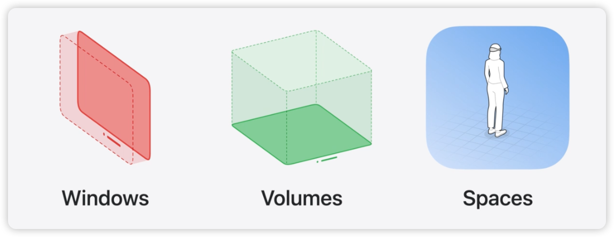

> Window：创建一个或多个的窗口，可以包含传统的视图或者控件，也可以通过添加 3D 内容来增强深度上的体验；
>
> Volume：提供了一个固定比例、不会占用整个空间的容器，在任何距离都保持相同的大小，支持从任何角度查看；
>
> Space：更充分的利用 visionOS 提供的无限空间，可以把物体放在 Window 之外、用户周围，为用户创建身临其境的体验。
>
> 有关  Window、Volune 和 Space 的更多内容，可以参考：
>
> 1. WWDC2023 [Take SwiftUI to the next dimension](https://developer.apple.com/videos/play/wwdc2023/10113)；
> 2. WWDC2023 [Go beyond the window with SwiftUI]((https://developer.apple.com/videos/play/wwdc2023/10111/))；
> 3. WWDC2023 内参 [使用 ImmersiveSpace 让 SwiftUI 跃出屏幕](https://xiaozhuanlan.com/topic/2586749130)。

在绘画 App 中，用户通过捏合并移动手指来完成绘画，因此绘图 App 需要了解用户的手势。我们需要为手部锚点设置空间跟踪(Spatial tracking)。

当 App 使用 Space 时，可以通过锚点(Anchor)接收空间跟踪信息。包括通过世界锚点(World Anchor)和平面锚点(Plane Anchor)获取场景理解信息(Scene Understanding Information)，用手部锚点(Hand Anchor)获取姿势信息(Pose Information)等。

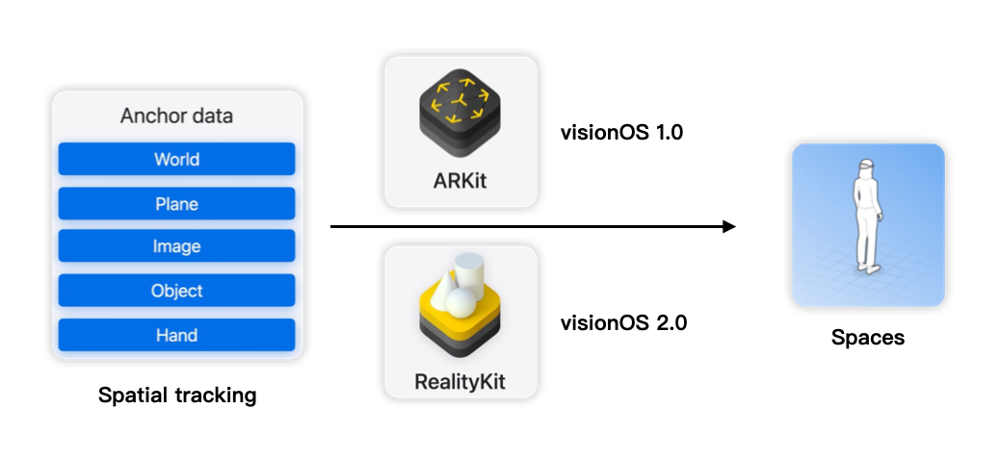在 visionOS 1.0 中，我们可以使用 ARKit 访问此数据。在 visionOS 2.0 中，Apple 引入了一种更简单的方法，让我们可以直接在 RealityKit 中使用空间跟踪。

### 获取空间跟踪数据权限

在 RealityKit 中，我们使用 `AnchorEntity` 将 RealityKit Entity 固定到 AR 锚点上。绘图 App 可以为每只手创建两个 `AnchorEntitiey`。分别锚定在拇指尖、食指尖，如下左 1 图所示：

|  |  |
| ------------------------------------------------------------ | --------------------------------------------------- |

为了访问空间跟踪数据，App 需要获取用户的授权。同时，考虑何时向用户请求权限非常重要，应只在需要授权时请求授权。在示例 App 中，如上左 2 图所示，当用户点击“Start”，才会请求相关权限。

在 RealityKit 中请求跟踪数据的授权，可以使用 visionOS 2.0 中的新 API—— [`SpatialTrackingSession`](https://developer.apple.com/documentation/RealityKit/SpatialTrackingSession)。其帮助我们管理 RealityKit App 中的空间跟踪功能，通过配置相应的 [`SpatialTrackingSession.Configuration`](https://developer.apple.com/documentation/realitykit/spatialtrackingsession/configuration) 来决定 App 需要哪些 AR 数据，接着在 `SpatialTrackingSession` 上调用 [`run(_:)`](https://developer.apple.com/documentation/realitykit/spatialtrackingsession/run(_:))，会提示用户进行授权。

在绘画 App 中，我们只需要需要手部数据：

```swift
// 1. 创建 Session
let session = SpatialTrackingSession()
// 2. 声明所需的跟踪数据
let configuration = SpatialTrackingSession.Configuration(tracking: [.hand])
// 3. 请求空间跟踪授权
let unapprovedCapabilities = await session.run(configuration)
```

> [`AnchorCapability`](https://developer.apple.com/documentation/realitykit/spatialtrackingsession/configuration/anchorcapability) 提供多种锚点能力，包括 [`body`](https://developer.apple.com/documentation/realitykit/spatialtrackingsession/configuration/anchorcapability/body) 身体追踪、[`camera`](https://developer.apple.com/documentation/realitykit/spatialtrackingsession/configuration/anchorcapability/camera) 相机锚定、[`face`](https://developer.apple.com/documentation/realitykit/spatialtrackingsession/configuration/anchorcapability/face) 人脸追踪、[`hand`](https://developer.apple.com/documentation/realitykit/spatialtrackingsession/configuration/anchorcapability/hand)  手部追踪、[`image`](https://developer.apple.com/documentation/realitykit/spatialtrackingsession/configuration/anchorcapability/image) 图像追踪、[`object`](https://developer.apple.com/documentation/realitykit/spatialtrackingsession/configuration/anchorcapability/object) 对象跟踪、[`plane`](https://developer.apple.com/documentation/realitykit/spatialtrackingsession/configuration/anchorcapability/plane) 平面检测、[`world`](https://developer.apple.com/documentation/realitykit/spatialtrackingsession/configuration/anchorcapability/world) 世界追踪。
>
> 此外，`SpatialTrackingSession`  同时支持 iOS 18.0+、iPadOS 18.0+，提供：
>
> 1. 访问例如阴影、遮挡、物理等场景理解数据(Scene Understanding Data)；
> 2. 配置  [`worldTracking`](https://developer.apple.com/documentation/realitykit/realityviewcamera/worldtracking) 使用的摄像头，使用前置或后置摄像头。

`run(_:)` 函数返回用户未批准的跟踪功能列表，我们通过检查此列表了解授权状态：

```swift
if let unapprovedCapabilities, unapprovedCapabilities.anchor.contains(.hand) {
    // 1. 用户拒绝 App 访问手部追踪数据
} else {
    // 2. 用户批准 App 访问手部追踪数据
}
```

1. 如果用户未授权，AnchorEntity 的 `transform`  将不会更新，但是仍会在视觉上更新其姿势(隐私保护)；
2. 如果用户授权，我们可以通过 AnchorEntity 的 `transform` 访问跟踪数据。

本质上，`SpatialTrackingSession` 是根据我们传入的配置来配置 ARKit。因此，我们也可以手动设置 ARKit Session，并订阅 ARKit 的更新来接收锚点 `transform`，然后手动设置 Entity 的 `transform`。这使我们能够完全访问锚点属性，但需要进行更多设置。使用 `SpatialTrackingSession`，RealityKit 会我们处理该问题，并使  AnchorEntity 与目标锚点对齐。

> 更多有关使用 ARKit 的 [`HandTrackingProvider`](https://developer.apple.com/documentation/arkit/handtrackingprovider/) 的信息，可以参考 WWDC2023 [Meet ARKit for spatial computing](https://developer.apple.com/videos/play/wwdc2023/10082/)。

综上，在 Space 下，可以使用 `AnchorEntity` 来设置 RealityKit 锚定的内容；可以使用 `SpatialTrackingSession` 访问 `AnchorEntity` 的 `transform` 数据；使用 `SpatialTrackingSession`， `AnchorEntity` 可以与 RealityKit 的物理系统交互。

## 二、构建空间界面

用户点击启动画面上的“Start”后，将进入沉浸式体验(Immersive Experience)，绘图画布将展示在用户眼前：

|  |  |  |
| ----------------------------------------------------- | ------------------------------------------------- | ------------------------------------------------------- |

1. 如上左 1 图所示，用户可以通过拖动手柄来更改画布的位置，通过视图滑块调整画布的大小；
2. 如上左 2 图所示，用户设置好画布，调色板视图将出现，允许用户选择画笔、配置画笔的形状和颜色等；
3. 如上左 3 图所示，用户需进入画布即可开始绘画，用户无法在画布外进行绘画。

画布通过两个元素构建：地面的 3D 形状勾勒出画布的边缘、手柄来更改画布的位置。

### 将 2D 矢量内容转换为 3D 模型

首先，我们来看边界网格。此网格是实时生成的，可以通过拖动视图中的滑块来修改边界的大小。网格由两个圆圈定义，如左 2 图所示，外圆为绿色，内圆为红色：

| 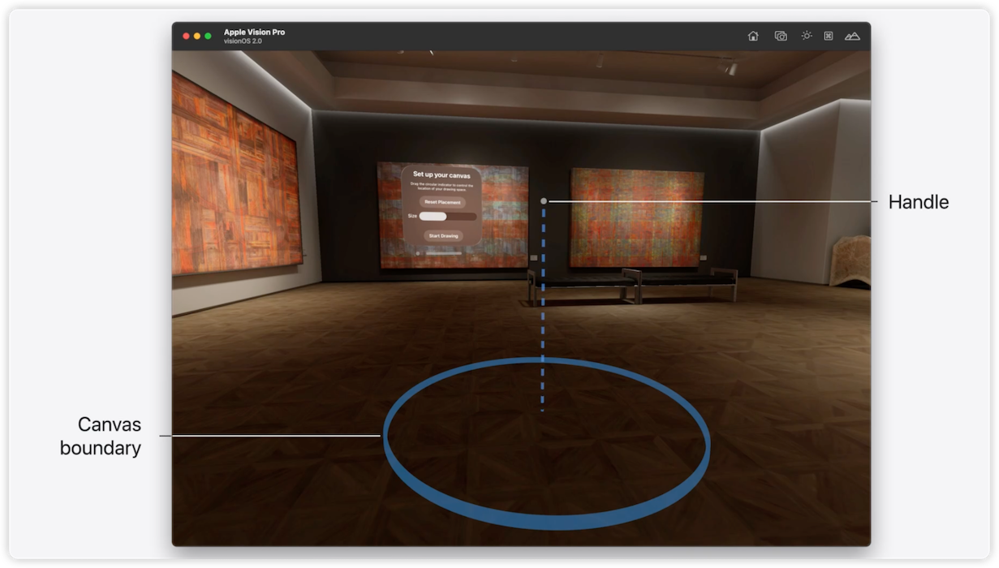 | 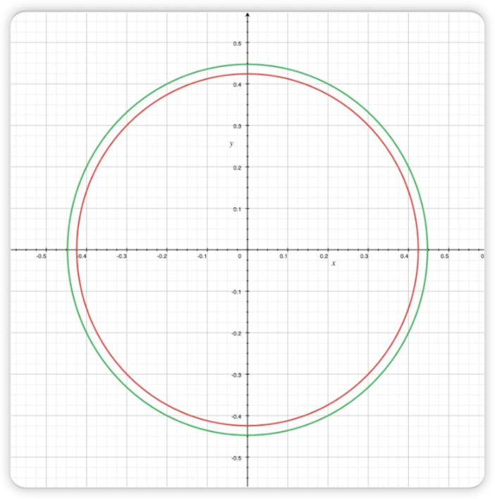 |
| --------------------------------------- | --------------------------------------- |

我们可以使用 `SwiftUI.Path` 定义此路径：

```swift
let path = SwiftUI.Path { path in
    path.addArc(center: .zero, radius: outerRadius, // 1
        startAngle: .degrees(0), endAngle: .degrees(360),
        clockwise: true)
    path.addArc(center: .zero, radius: innerRadius,
        startAngle: .degrees(0), endAngle: .degrees(360),
        clockwise: true)
}.normalized(eoFill: true) // 2
```

1. 圆是一条 360 度的弧，我们创建了两个这样的弧，每个弧的半径不同;
2. 使用 [`normalized(eoFill:)`](https://developer.apple.com/documentation/swiftui/path/normalized(eofill:)) 的奇偶规则填充，从而得到我们想要创建的形状。

> 在二维计算机图形学中，曲线根据两个规则进行填充：[奇偶规则](https://en.wikipedia.org/wiki/Even–odd_rule)(下左 1 图)和[非零缠绕规则](https://en.wikipedia.org/wiki/Nonzero-rule)(下左 2 图)。在每种情况下，箭头表示从点 P 发出的射线延伸出曲线：
> 1. 在奇偶情况下，射线与两条线相交，即偶数；因此，P 被断定为曲线“外部”。
> 2. 根据非零缠绕规则，射线沿顺时针方向相交两次，每次都为缠绕分数贡献 -1：因为总数 -2 不为零，所以 P 被断定为曲线“内部”。
> 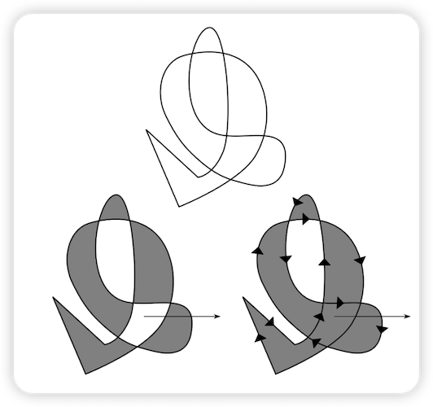
> 更多有关路径的填充的信息可以参阅[Quartz 2D 编程指南](https://developer.apple.com/library/archive/documentation/GraphicsImaging/Conceptual/drawingwithquartz2d/Introduction/Introduction.html)中的[填充路径](https://developer.apple.com/library/archive/documentation/GraphicsImaging/Conceptual/drawingwithquartz2d/dq_paths/dq_paths.html#//apple_ref/doc/uid/TP30001066-CH211-TPXREF106)。

RealityKit 的新 API [`MeshResource`](https://developer.apple.com/documentation/realitykit/meshresource) ，[`init(extruding:extrusionOptions:)`](https://developer.apple.com/documentation/realitykit/meshresource/init(extruding:extrusionoptions:)-3h21u) 可以帮助我们快速生成网格，将 2D 矢量内容转换为 3D 模型。我们需要做的就是指定形状所需的分辨率 [`boundaryResolution`](https://developer.apple.com/documentation/realitykit/meshresource/shapeextrusionoptions/boundaryresolution) 和深度 [`extrusionMethod`](https://developer.apple.com/documentation/realitykit/meshresource/shapeextrusionoptions/extrusionmethod-swift.property)：

```swift
var options = MeshResource.ShapeExtrusionOptions()
// 形状的分辨率，对于曲线的每个跨度(Span)，生成均匀数量的段(Segment)
options.boundaryResolution = .uniformSegmentsPerSpan(segmentCount: 64)
// 深度，将形状在 Z 方向上挤压 extrusionDepth 米
options.extrusionMethod = .linear(depth: extrusionDepth)

return try MeshResource(extruding: path, extrusionOptions: extrusionOptions)
```

> 跨度和段是计算机图形学中描述曲线特性的两个重要参数。跨度定义了参数变量的取值范围，从而影响了曲线的形状和绘制效果；而段则是构成曲线的基本单元或组件，通过不同的连接方式形成一个连续且平滑的整体曲线。
>
> 同一个跨度内段数的增加可以提高曲线的精度和平滑度，但也会增加计算成本、控制点数量、数据存储需求和可能对渲染性能产生负面影响。因此，在选择段数时需要根据具体的应用需求进行权衡和取舍。

在 visionOS 上，RealityKit 使用注视点渲染器(Foveated Renderer)——图像在非视觉中心的周边区域，会以较低的分辨率渲染。这有助于优化应用的性能。但是，如果场景包含高对比度的薄几何图形，可能会出现闪烁的伪影。如下左 1 图所示，因为环太薄了，环的视觉表现不尽人意。

为了解决这个问题，我们可以增加几何体的厚度，移除较薄的高对比度边缘。如下左 2 图所示，左侧增加几何体的厚度后，伪影有所减轻：

| 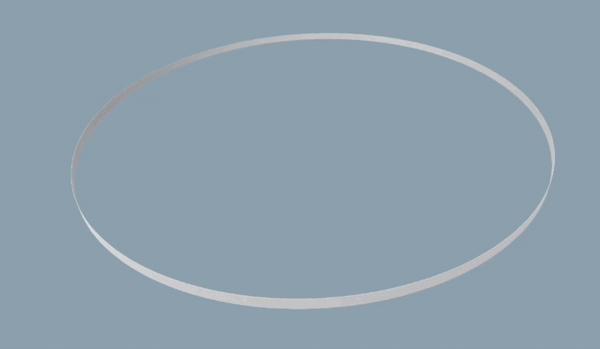 | 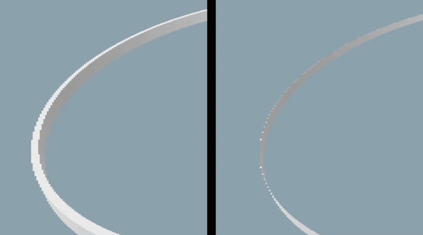 |
| ------------------------------------------------ | ------------------------------------------------------------ |

> 更多有关空间内容混叠的信息，可以参考 WWDC2023 [Explore rendering for spatial computing](https://developer.apple.com/videos/play/wwdc2023/10095/)。

### 聚光灯和高亮悬停效果

在 visionOS 上，当用户查看实体或直接触摸实体时，实体被视为悬停(Hovered)。具体实现上，[`HoverEffectComponent`](https://developer.apple.com/documentation/realitykit/hovereffectcomponent?changes=_3) 会在用户注视 RealityKit 内容时添加视觉效果。在 visionOS 1.0 中，`HoverEffectComponent` 使用聚光灯(Spotlight)效果。今年，Apple  引入了另外两种悬停效果：

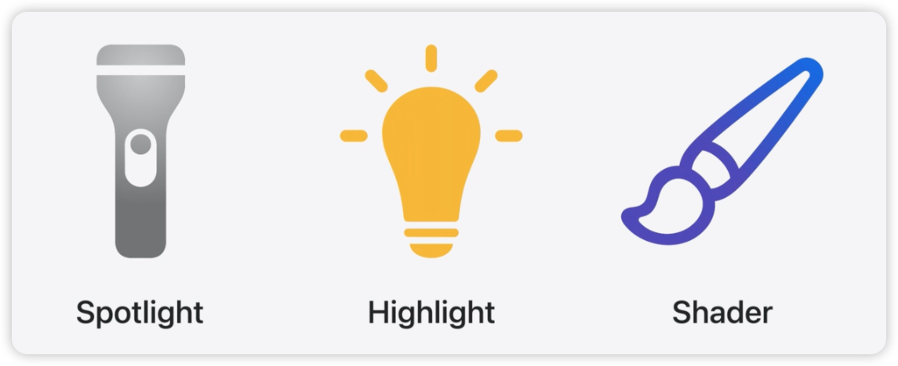

1. 高亮(Highlight)效果将高亮颜色应用于 Entity；
2. 与着色器图(ShaderGraph)着色器(Sharder)一起使用，着色器支持的悬停效果非常灵活，可以精确控制实体在悬停时的外观。

在示例项目中，如下左 1 图所示，当用户注视手柄时，会出现蓝色高亮效果。笔者对高亮(左)和聚光灯(右)效果进行了同一颜色、强度的对比，如下左 2 图所示：

| 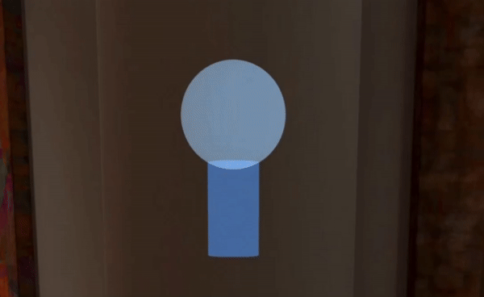 | 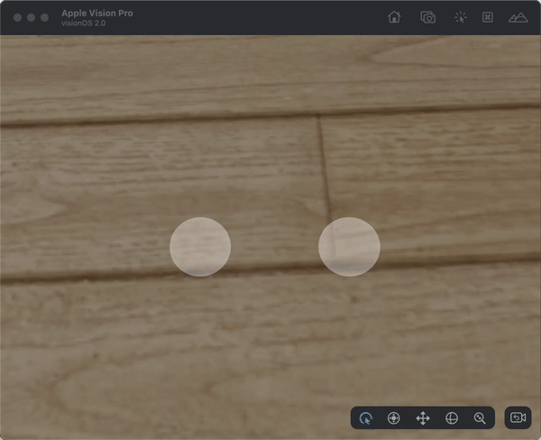 |
| --------------------------------------------------- | -------------------------------------------------------- |

要使用高亮效果，请为 Entity 添加 `HoverEffectComponent`，使用 [`init(color:strength:)`](https://developer.apple.com/documentation/realitykit/hovereffectcomponent/highlighthovereffectstyle/init(color:strength:)-3wyrf?changes=_3) 构造 [`HighlightHoverEffectStyle`](https://developer.apple.com/documentation/realitykit/hovereffectcomponent/highlighthovereffectstyle?changes=_3) 提供高亮色和强度。高亮和聚光灯效果的使用代码如下：

```swift
let placementEntity: Entity = // ...
// visionOS 2.0 使用高亮悬停效果
let hover = HoverEffectComponent(
    .highlight(.init(
        color: UIColor(/* ... */), // 高亮色
        strength: 5.0)             // 强度
    )
)
// visionOS 1.0 使用聚光灯悬停效果
let hover = HoverEffectComponent(
    .spotlight(.init(
        color: UIColor(/* ... */), // 高亮色
        strength: 10)              // 强度
     )
)
placementEntity.components.set(hover)
```

此外，实体被视为悬停时，其后面的环境上有隐约发光。这是因为其材质添加了混合模式 [`MaterialParameterTypes.BlendMode`]( https://developer.apple.com/documentation/realitykit/unlitmaterial/program-swift.class/descriptor-swift.struct/blendmode?changes=_3)。今年，RealityKit 在其内置材质(例如 [UnlitMaterial](https://developer.apple.com/documentation/realitykit/unlitmaterial?changes=_3) 和 [PhysicallyBasedMaterial](https://developer.apple.com/documentation/realitykit/physicallybasedmaterial?changes=_3))中增加了对添加混合模式的支持：

```swift
var descriptor = UnlitMaterial.Program.Descriptor()
descriptor.blendMode = .add // 混合模式
let prog = await UnlitMaterial.Program(descriptor: descriptor)
var material = UnlitMaterial(program: prog)
material.color = UnlitMaterial.BaseColor(tint: UIColor(/* ... */))
```

> 更多有关材质的信息，可以参考 [Materials and shaders](https://developer.apple.com/documentation/realitykit/realitykit-materials-shaders)。

### 着色器悬停效果

当用户设置好画布，调色板视图就会出现，用户可以开始设置他们的画笔。绘画 App 允许用户自定义画笔类型和样式。在调色板的底部，有一组预设画笔可供用户选择：

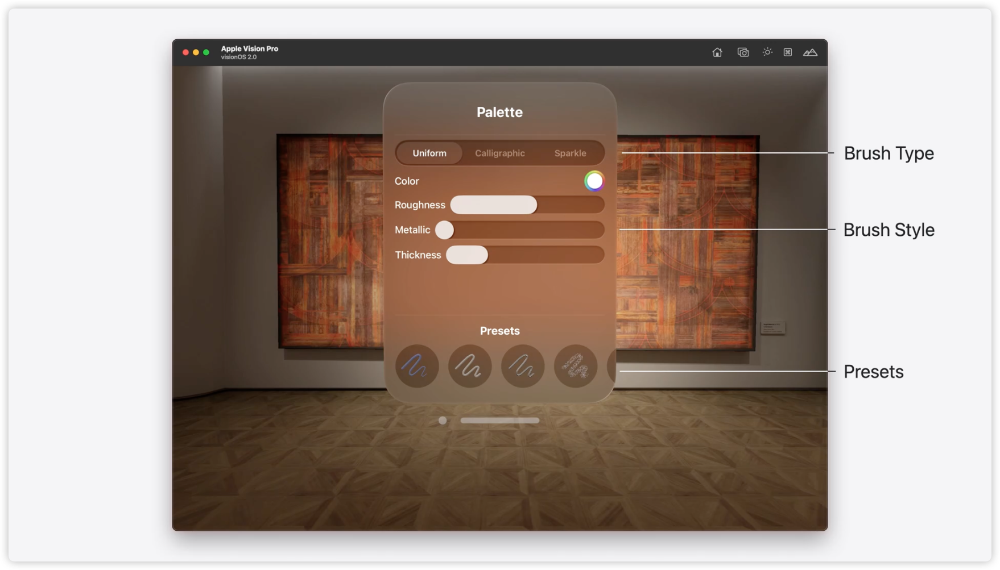

如下左 1 图所示，每个画笔的预设缩略图实际上都是一个完整的三维形状，SwiftUI 和 RealityKit 无缝集成在一起。在这里，我们对每个缩略图使用一个 `RealityView`，这使我们能够充分利用 RealityKit 的全部功能。

如下左 2 图所示，当用户凝视画笔的预设缩略图时，会激活悬停效果，并沿着画笔扫过紫色光芒。这是一种基于着色器的悬停效果，让我们深入研究一下如何实现这种效果。

|  | 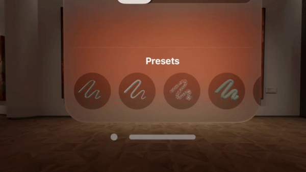 |
| ----------------------------------------- | ----------------------------------------------------------- |

着色器悬停效果，通过着色器图(ShaderGraph)中的悬停状态节点(Hover State Node)启用。如下左 1 图所示，此节点可让我们将悬停效果集成到着色器中。以强度(Intensity)为例，强度是系统提供的值，根据用户的注视状态，在 [0, 1] 之间进行动画处理，我们可以使用不同的强度值来创建高亮效果。

但是，我们希望实现更高级的悬停效果，如上文画笔的预设缩略图，从笔触开始扫过紫色光芒。为了实现这种复杂的效果，应用程序使用了着色器图，如下左 2 图所示：

| 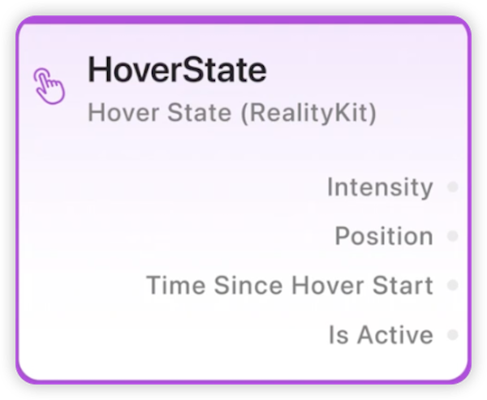 | 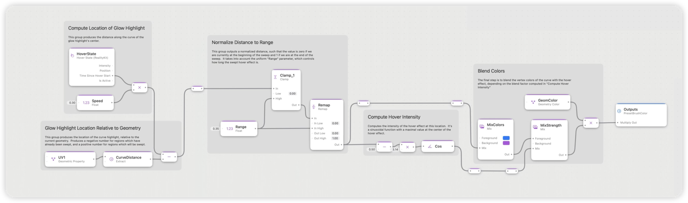 |
| :--------------------------------------------: | -------------------------------------- |

首先，我们使用悬停状态节点的 `TimeSinceHoverStart` 属性，该属性描述悬停事件开始以来的秒数值。我们将使用它来定义高光沿曲线的位置。如下左 2 图所示，悬停事件开始时，发光位置将开始沿曲线扫描：

| 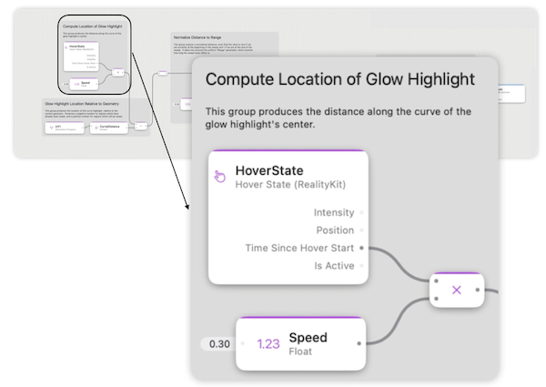 | 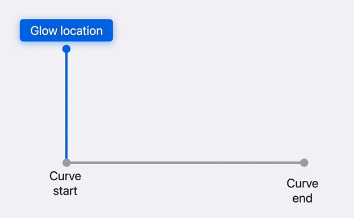 |
| ----------------------------------------------------------- | ------------------------------------------------------------ |

为笔触生成网格时，App 通过 UV1 通道为每个顶点提供 `CurveDistance` 值。如左 2 图所示，这是笔触上曲线距离的可视化，此值沿笔触长度增加。如左 3 图所示，着色器将高光的位置与曲线距离进行比较，着色器就可以了解高光位置相对于当前几何体的位置：

| 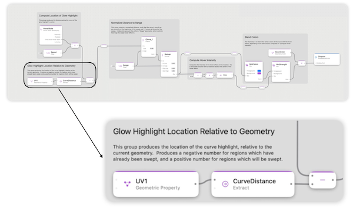 | 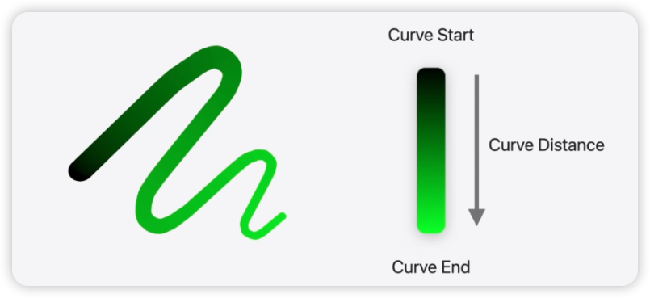 | 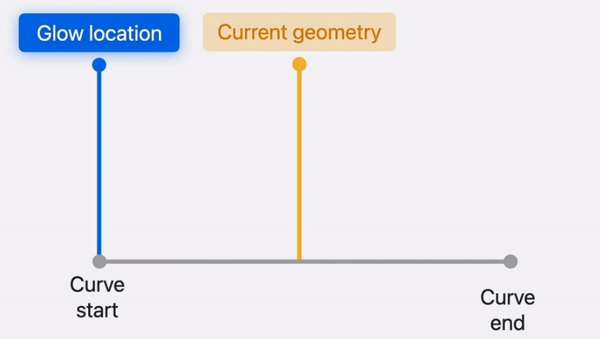 |
| ---------------------------------------------- | --------------------------------------------------------- | ------------------------------------------------------------ |

> UV 通道是计算机图形学中用于存储物体表面纹理坐标信息的一组数据。UV 坐标是一个二维坐标系，用于表示纹理图像上的位置。它通常由两个值(U 和 V)组成，分别代表纹理图像上的水平和垂直位置。UV 坐标与三维空间中的物体表面上的顶点相对应，使得二维纹理可以正确地映射到三维物体的表面上。

下一步是定义发光效果的大小，当前几何体在高光位置范围内时将发光：

| 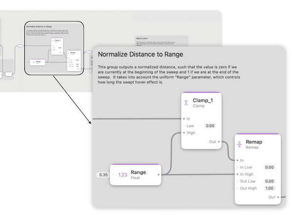 | 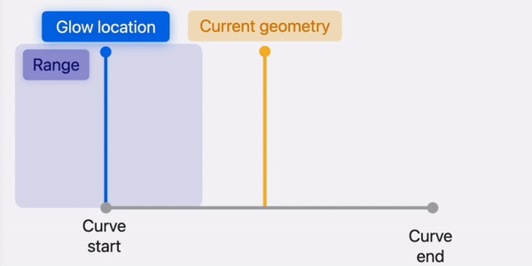 |
| ---------------------------------------------------- | ------------------------------------------------------------ |

可以添加缓和曲线，它定义了高光扫过几何体时悬停效果的强度：

| 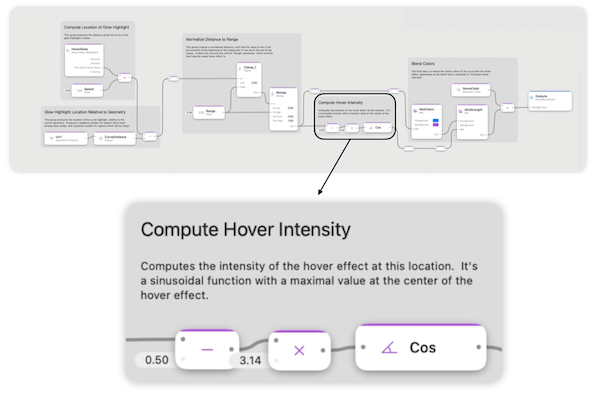 | 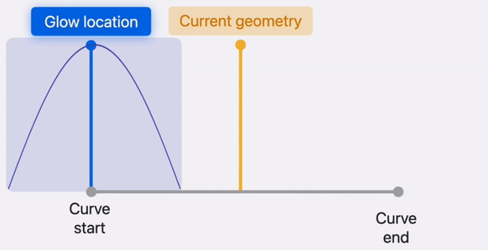 |
| ------------------------------------------------- | --------------------------------------------------------- |

最后一步是将悬停效果颜色与原始笔触颜色混合，具体取决于我们刚刚计算的强度值：

| 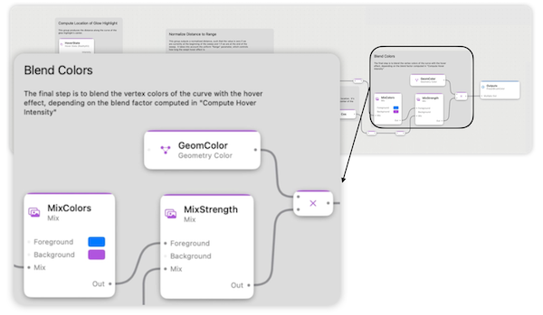 | 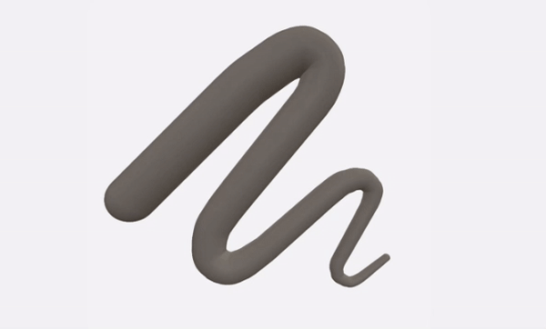 |
| ------------------------------------------------------------ | --------------------------------------------------------- |

上述流程，RealityKit 已经通过 [`ShaderGraphMaterial`](https://developer.apple.com/documentation/realitykit/shadergraphmaterial?changes=_3) 提供。要使用基于着色器的悬停效果，首先要使用 [`shader(_:)`](https://developer.apple.com/documentation/realitykit/hovereffectcomponent/hovereffect-swift.struct/shader(_:)?changes=_3) 创建一个 `HoverEffectComponent`。然后使用 `ShaderGraphMaterial`，它将处理对悬停状态节点的更新：

```swift
// Use shader-based hover effects
let hoverEffectComponent = HoverEffectComponent(.shader(.default))
entity.components.set(hoverEffectComponent)

let material = try await ShaderGraphMaterial(named: "/Root/SolidPresetBrushMaterial",
                                             from: "PresetBrushMaterial",
                                             in: realityKitContentBundle)

entity.components.set(ModelComponent(mesh: /* ... */, materials: [material]))
```

## 三、构建画笔几何

### 自定义缓冲区布局

我们已经为用户构建了一种配置画笔的方法，现在是讨论为每个笔触生成几何图形。广义上讲，网格是顶点(Vertex)和连接它们的图元(Primitive)的集合。每个顶点都与许多属性相关联，例如该顶点的位置或纹理坐标。这些属性由数据描述，例如每个顶点位置都是一个三维向量：

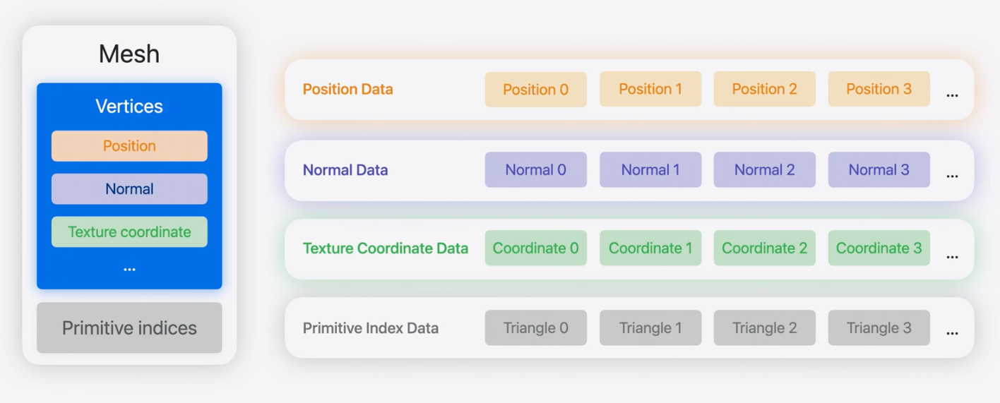

顶点数据需要组织成缓冲区(Buffer)，以提交给 GPU。对于大多数 RealityKit 的网格，数据在内存中是连续组织的。即内存中的顶点位置 0 后是顶点位置 1，然后是顶点位置 2，依此类推，所有其他顶点属性同理。索引缓冲区(Index Buffer)是单独布局的，它包含网格中每个三角形的顶点索引：

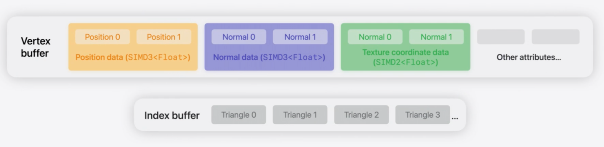

上述 RealityKit 的标准网格布局用途广泛，适用于许多不同的用例。

但在某些情况下，非标准网格布局方法可能更有效。绘图 App 使用定制的几何处理管道(Geometry Processing Pipeline)来创建用户笔触的网格，每个笔触都会被平滑以改善网格曲率。该算法经过优化，尽可能快地将点附加到笔触的末端，最大限度地减少延迟：


> 几何处理管道，也称为几何管道或变换管道，负责将三维世界中的物体转换并呈现为二维图像。通过了解和优化几何处理管道的各个阶段，可以提高图形渲染的性能和质量。

对于绘画 App 的笔触网格布局，使用单个缓冲区来布局顶点。笔触网格每个顶点都是一个接一个地完整描述的，属性是交错的。第一个顶点的位置后面是该顶点的法线、双切线，直到所有属性都描述完毕。接着缓冲区才开始描述第二个顶点，依此类推：

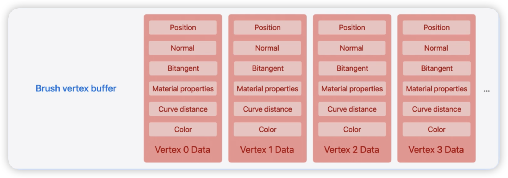

绘画 App 的笔触网格布局与标准网格布局不同，标准网格布局会连续布局每个属性的所有数据：

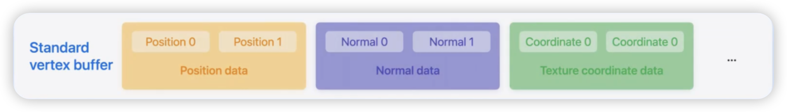

画笔顶点缓冲区布局对于绘图 App 特别方便。生成笔触时，App 会不断将顶点附加到顶点缓冲区的末尾，而无需修改旧数据的位置。此时，如果我们使用标准顶点缓冲区执行此操作时，大多数数据都需要随着缓冲区的增长而移动。如下左 1 图所示为绘画 App 的笔触网格布局，下左 2 图所示为标准网格布局：

| 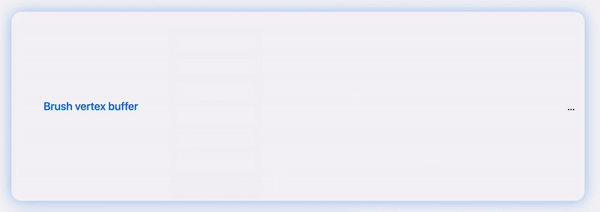 | 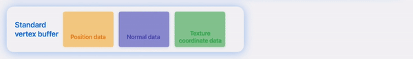 |
| ------------------------------------------------------------ | ------------------------------------------------------------ |

画笔顶点的属性也与标准布局中不同。一些属性(如位置、法线和双切线)是标准的。而其中一些属性(如颜色、材质属性和曲线距离)是自定义属性。在绘画 App 中，画笔顶点在 [Metal Shading Language(MSL)](https://developer.apple.com/documentation/metal) 中表示为这个结构：

```swift
struct SolidBrushVertex {
    packed_float3 position;
    packed_float3 normal;
    packed_float3 bitangent;
    packed_float2 materialProperties;
    float curveDistance;
    packed_half3 color;
};
```

`SolidBrushVertex` 结构的每个属性都与顶点的一个属性相对应：

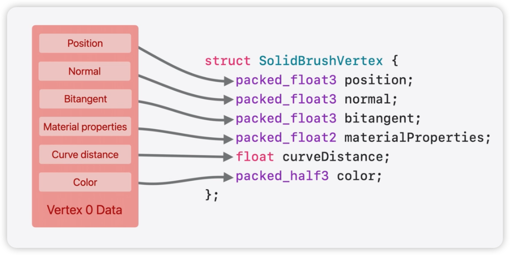

我们现在面临一个问题：一方面，我们希望保留高性能几何引擎的顶点布局，避免任何不必要的转换或复制。但另一方面，我们的几何引擎的布局与 RealityKit 的标准布局不兼容。

我们需要一种方法将我们的 GPU 缓冲区带到 RealityKit，并指示 RealityKit 如何读取它们。现在，我们可以使用一个名为 [`LowLevelMesh`](https://developer.apple.com/documentation/realitykit/lowlevelmesh?changes=_3) 的全新 API，可以以多种方式排列顶点数据。

我们有四个不同的 Metal 缓冲区可用于顶点数据。如下左 1 图所示，我们可以使用与 RealityKit 标准布局类似的布局。但现在我们拥有多个缓冲区，如下左 2 图所示，假设需要更频繁地更新纹理坐标，将这些动态数据移动到自己的缓冲区则更有效：

| 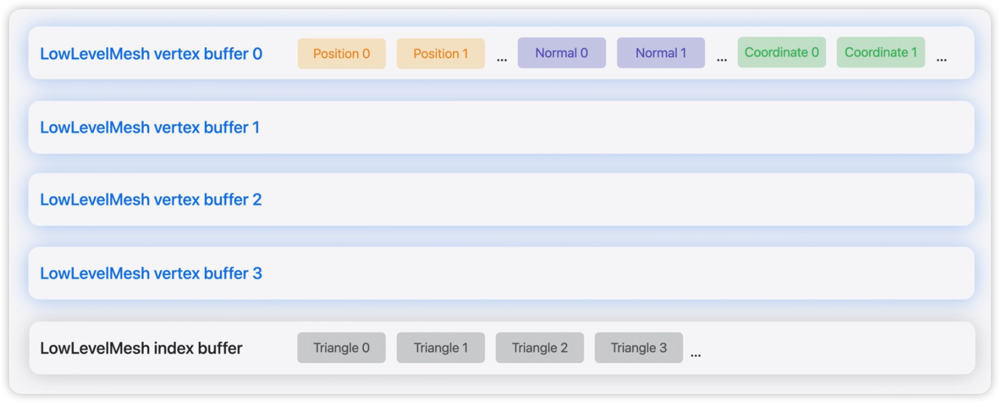 | 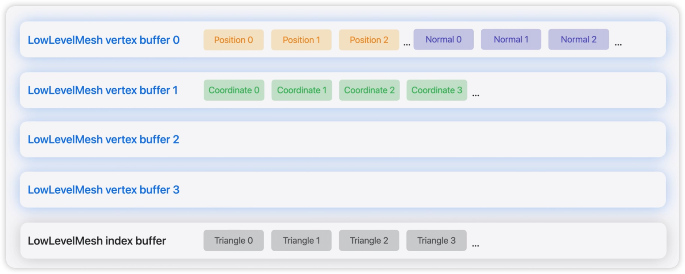 |
| ------------------------------------------------------------ | ------------------------------------------------------------ |

此外，如下左 1 图所示，我们可以交错排列顶点缓冲区；如下左 2 图所示，我们可还以进行交错和非交错的组合：

| 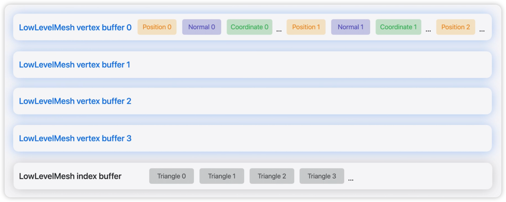 | 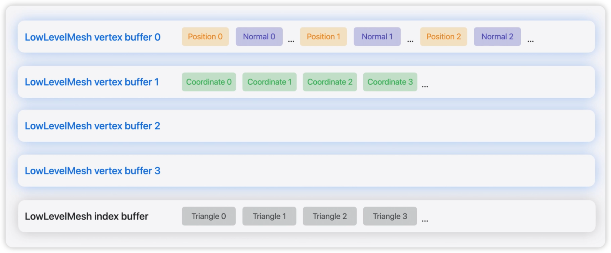 |
| ------------------------------------------------------------ | ------------------------------------------------------------ |

我们还可以使用任何 Metal 的基本类型，例如三角形条带(Triangle Strips)。Apple 鼓励开发者思考 `LowLevelMesh` 及其自定义缓冲区布局如何使 App 受益。

`LowLevelMesh` 扩展了向 RealityKit 提供网格数据的可能性。也许我们的自定义布局的网格数据来自二进制文件，现在，我们可以将该数据直接传输到 RealityKit，无需任何转换开销。或者，我们正在将现有的网格处理管道及其预定义缓冲区布局(如在数字内容创建工具或 CAD 应用程序中看到的布局)桥接到 RealityKit。我们甚至可以使用 `LowLevelMesh` 作为一种将游戏引擎中的网格数据桥接到 RealityKit 的高效方法。

| 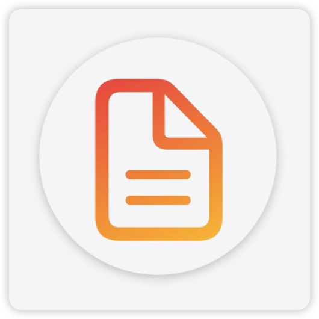 | 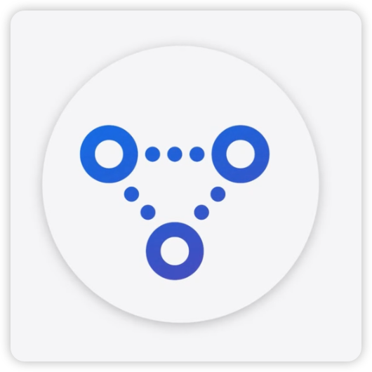 | 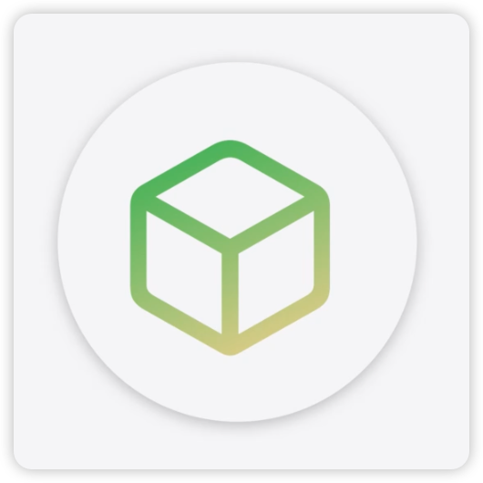 |
| ------------------------------------------------------ | ------------------------------------------------------------ | ------------------------------------------------------------ |

绘画 App 可以按原样将其顶点缓冲区提供给 `LowLevelMesh`，而无需任何额外的转换或不必要的复制。绘画 App 在 `SolidBrushVertex` 结构的扩展中设置属性列表。首先声明位置属性：

```swift
extension SolidBrushVertex {
    static var vertexAttributes: [LowLevelMesh.Attribute] {
        typealias Attribute = LowLevelMesh.Attribute
        return [
            Attribute(
                semantic: .position, // 1
                format: MTLVertexFormat.float3, // 2
                layoutIndex: 0, // 4
                offset: MemoryLayout.offset(of: \Self.position)! // 3
            ),
            // ...
        ]
    }
}
```

1. 首先声明位置属性。第一步是定义一个语义，它指示 `LowLevelMesh` 如何解释属性。在示例中使用 `.position`；

2.  接下来为该属性定义 Metal 顶点格式。在示例中选择 `MTLVertexFormat.float3`；
3. 接下来提供属性的字节偏移量 `MemoryLayout.offset(of: \Self.position)!`；
4. 最后将提供布局索引 `layoutIndex: 0`。这将索引到顶点布局列表中，绘图 App 仅使用单个布局，因此使用 `0`。

现在，我们声明其他网格属性。法线和双切线属性与位置类似，只是使用不同的语义和内存偏移量：

```swift
Attribute(semantic: .normal, format: MTLVertexFormat.float3, layoutIndex: 0,
          offset: MemoryLayout.offset(of: \Self.normal)!),
Attribute(semantic: .bitangent, format: MTLVertexFormat.float3, layoutIndex: 0,
          offset: MemoryLayout.offset(of: \Self.bitangent)!),
```

颜色属性使用半精度浮点值。这是今年新增的功能，我们可以将任何 Metal 顶点格式与 `LowLevelMesh` 一起使用，包括压缩顶点格式(Compressed Vertex Formats)：

```swift
Attribute(semantic: .color, format: MTLVertexFormat.half3, layoutIndex: 0,
          offset: MemoryLayout.offset(of: \Self.color)!),
```

对于其他两个参数，我们将使用语义 UV1 和 UV3。`LowLevelMesh` 中最多有 8 个 UV 通道可供开发者使用。`ShaderGraphMaterial` 可以访问这些值：

```swift
Attribute(semantic: .uv1, format: MTLVertexFormat.float, layoutIndex: 0,
          offset: MemoryLayout.offset(of: \Self.curveDistance)!),
Attribute(semantic: .uv3, format: MTLVertexFormat.float2, layoutIndex: 0,
          offset: MemoryLayout.offset(of: \Self.materialProperties)!)
```

现在，我们可以创建 `LowLevelMesh` 对象本身。首先创建一个 `LowLevelMesh` 描述符 `Descriptor`。描述符在概念上类似于 Metal 的 `MTLVertexDescriptor`，但它还包含 RealityKit 摄取网格所需的信息：

```swift
private static func makeLowLevelMesh(vertexBufferSize: Int, indexBufferSize: Int, 
                                     meshBounds: BoundingBox) throws -> LowLevelMesh
{
    var descriptor = LowLevelMesh.Descriptor()
}
```

```swift
var descriptor = LowLevelMesh.Descriptor()

descriptor.vertexCapacity = vertexBufferSize // 1
descriptor.indexCapacity = indexBufferSize
descriptor.vertexAttributes = SolidBrushVertex.vertexAttributes // 2

let stride = MemoryLayout<SolidBrushVertex>.stride
descriptor.vertexLayouts = [LowLevelMesh.Layout(bufferIndex: 0, // 3
                                                bufferOffset: 0, bufferStride: stride)] // 4

let mesh = try LowLevelMesh(descriptor: descriptor) // 5

mesh.parts.append(LowLevelMesh.Part(indexOffset: 0, indexCount: indexBufferSize, // 6
                                    topology: .triangleStrip, materialIndex: 0,  // 7
                                    bounds: meshBounds))
return mesh
```

1. 声明顶点和索引缓冲区所需的容量 `vertexBufferSize` 和 `indexBufferSize`；
2. 传递顶点属性列表 `SolidBrushVertex.vertexAttributes`；
3. 列出顶点布局，每个顶点属性都使用其中一种布局。`LowLevelMesh` 为我们的顶点数据提供最多 4 个 Matal 缓冲区。缓冲区索引 `bufferIndex` 声明应使用哪个缓冲区；
4. 提供缓冲区偏移量 `bufferOffset` 和每个顶点的步幅 `bufferStride`。大多数情况下，我们只会使用一个缓冲区。

5. 使用 `descriptor` 构造 `LowLevelMesh`；
6. 然后是填充 `parts` 列表，每个 `parts` 都跨越索引缓冲区的一个区域，我们可以为每个网格 `parts` 分配不同的 RealityKit 材质索引；
7. App 使用三角形带状拓扑结构 `.triangleStrip` 来提高内存效率。

最后，可以从 `LowLevelMesh` 创建 `MeshResource` 并将其分配给实体的 `ModelComponent`：

```swift
let mesh: LowLevelMesh
let resource = try MeshResource(from: mesh)
entity.components[ModelComponent.self] = ModelComponent(mesh: resource, materials: [...])
```

当需要更新 `LowLevelMesh` 的顶点数据时，我们可以使用 [`withUnsafeMutableBytes(bufferIndex:_:)`](https://developer.apple.com/documentation/realitykit/lowlevelmesh/withunsafemutablebytes(bufferindex:_:)?changes=_3) API。此 API 允许我们访问实际缓冲区，该缓冲区将提交给 GPU 进行渲染。因为我们预先知道网格的内存布局，所以我们可以使用 `bindMemory` 将提供的原始指针转换为缓冲区指针：

```swift
let mesh: LowLevelMesh
mesh.withUnsafeMutableBytes(bufferIndex: 0) { buffer in
    let vertices: UnsafeMutableBufferPointer<SolidBrushVertex>
        = buffer.bindMemory(to: SolidBrushVertex.self)
    // Write to vertex buffer `vertices`
}
```

索引缓冲区数据也是如此，我们可以通过 [`withUnsafeMutableIndices(_:)`](https://developer.apple.com/documentation/realitykit/lowlevelmesh/withunsafemutableindices(_:)?changes=_3) 更新我们的 `LowLevelMesh` 索引缓冲区：

```swift
let mesh: LowLevelMesh
mesh.withUnsafeMutableIndices { buffer in
    let indices: UnsafeMutableBufferPointer<UInt32>
        = buffer.bindMemory(to: UInt32.self)

    // Write to index buffer `indices`
}
```

### 使用 GPU 支持顶点或索引缓冲区更新

 `LowLevelMesh` 不仅可以加速网格处理管道，还允许我们使用 GPU 支持顶点或索引缓冲区更新。如下图所示，是绘图 App 中的闪光笔刷，它会生成一个跟随笔触的粒子场，此粒子场每帧都会动态更新。由于网格更新的频率和复杂性，使用 GPU 是有意义的。


闪光笔刷包含每个粒子属性的列表，例如位置和颜色，还包括 `curveDistance` 参数以及粒子的大小：

```swift
struct SparkleBrushAttributes {
    packed_float3 position;
    packed_half3 color;
    float curveDistance;
    float size;
};
```

绘画 App 的 GPU 粒子模拟使用 `SparkleBrushParticle` 类型来跟踪每个粒子的属性和速度。使用 `SparkleBrushParticles` 的辅助缓冲区(Auxiliary Buffer)进行模拟：

```swift
// Describes a particle in the simulation
struct SparkleBrushParticle {
    struct SparkleBrushAttributes attributes;
    packed_float3 velocity;
};

// One quad (4 vertices) is created per particle
struct SparkleBrushVertex {
    struct SparkleBrushAttributes attributes;
    simd_half2 uv;
};
```

`SparkleBrushVertex` 结构用于网格的顶点数据。它包含每个顶点的 UV 坐标，以便着色器能够理解如何在 3D 空间中定位粒子，为每个粒子创建一个具有四个顶点的平面。因此，App 需要维护两个缓冲区来更新闪光笔刷网格，即填充了 `SparkleBrushParticles` 的粒子模拟缓冲区和包含 `SparkleBrushVertices` 的 `LowLevelMesh` 顶点缓冲区。

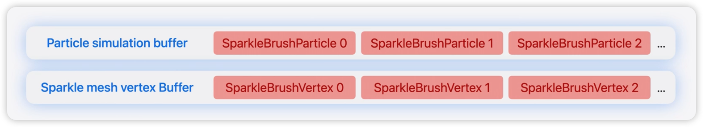

就像实心画笔一样，使用 `LowLevelMesh` 属性列表提供顶点缓冲区的规范。属性列表与 `SparkleBrushVertex` 的成员相对应：

```swift
extension SparkleBrushVertex {
    static var vertexAttributes: [LowLevelMesh.Attribute] {
        typealias Attribute = LowLevelMesh.Attribute
        return [
            Attribute(semantic: .position, format: .float3, layoutIndex: 0,
                      offset: MemoryLayout.offset(of: \Self.attributes.position)!),
            Attribute(semantic: .color, format: .half3, layoutIndex: 0,
                      offset: MemoryLayout.offset(of: \Self.attributes.color)!),
            Attribute(semantic: .uv0, format: .half2, layoutIndex: 0,
                      offset: MemoryLayout.offset(of: \Self.uv)!),
            Attribute(semantic: .uv1, format: .float, layoutIndex: 0,
                      offset: MemoryLayout.offset(of: \Self.attributes.curveDistance)!),
            Attribute(semantic: .uv2, format: .float, layoutIndex: 0,
                      offset: MemoryLayout.offset(of: \Self.attributes.size)!)
        ]
    }
}
```

当需要在 GPU 上填充 `LowLevelMesh` 时，可以使用 Metal 命令缓冲区(Metal Command Buffer)和计算命令编码器(Compute Command Encoder)：

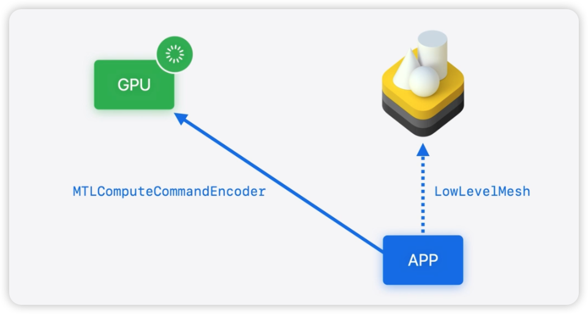

当缓冲区完成工作后，RealityKit 会自动应用更改。正如之前提到的，App 使用 Metal 缓冲区进行粒子模拟，使用 LowLevelMesh 作为顶点缓冲区：

```swift
let inputParticleBuffer: MTLBuffer
let lowLevelMesh: LowLevelMesh
```

我们设置一个 Metal 命令缓冲区和计算命令编码器，使 App 运行 GPU 计算内核来构建网格：

```swift
let commandBuffer: MTLCommandBuffer // Metal 命令缓冲区
let encoder: MTLComputeCommandEncoder // 计算命令编码器
let populatePipeline: MTLComputePipelineState

commandBuffer.enqueue()
encoder.setComputePipelineState(populatePipeline)
```

我们在 `LowLevelMesh` 上调用 [`replace(bufferIndex:using:)`](https://developer.apple.com/documentation/realitykit/lowlevelmesh/replace(bufferindex:using:)?changes=_3) 并提供命令缓冲区，返回一个 Metal 缓冲区。RealityKit 将直接使用此顶点缓冲区进行渲染：

```swift
let vertexBuffer: MTLBuffer = lowLevelMesh.replace(bufferIndex: 0, using: commandBuffer)

encoder.setBuffer(inputParticleBuffer, offset: 0, index: 0)
encoder.setBuffer(vertexBuffer, offset: 0, index: 1)
encoder.dispatchThreadgroups(/* ... */)

// ...
encoder.endEncoding()
commandBuffer.commit()
```

将模拟分发到 GPU 后，我们提交命令缓冲区。命令缓冲区完成后，RealityKit 将自动开始使用更新后的顶点数据：

```swift
let vertexBuffer: MTLBuffer = lowLevelMesh.replace(bufferIndex: 0, using: commandBuffer)

encoder.setBuffer(inputParticleBuffer, offset: 0, index: 0)
encoder.setBuffer(vertexBuffer, offset: 0, index: 1)
encoder.dispatchThreadgroups(/* ... */)

// ...
encoder.endEncoding()
commandBuffer.commit()
```

得益于快速且响应迅速的笔触生成，绘画 App 看起来很棒。

## 四、构建启动画面

### 构建  3D 文字和标志

启动画面来可以为 App 增添不一样的色彩，是欢迎用户进入 App 的好方法、展示 App 视觉风格的好机会。绘画 App 的启动画面包含四个视觉元素：

| 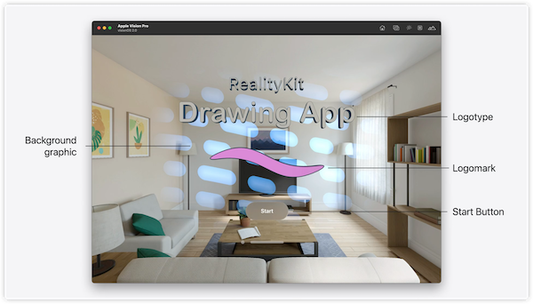 | 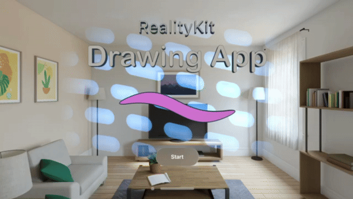 |
| ------------------------------------------------------- | --------------------------------------- |

1. 文字(Logotype)包含使用两种不同字体的 3D 文本“RealityKit” 和“Drawing App”；
2. 标志(Logomark)也是一个 3D 形状；
3. 底部有一个开始按钮(Start Button)，邀请用户开始绘图；
4. 背景中有一个醒目的图形(Background Graphic)，在环境中发光。

| 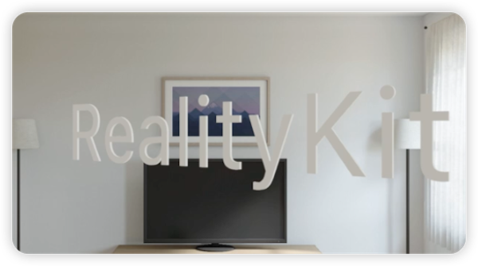 | 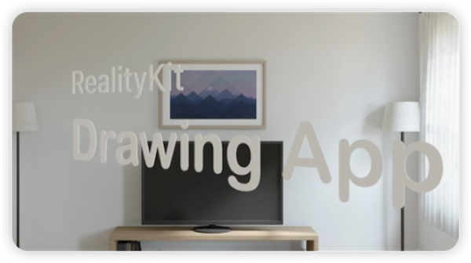 | 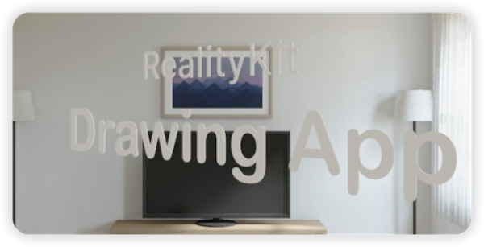 |
| -------------------------------- | --------------------------------------------- | ---------------------------------------- |

我们从构建徽标开始。如上左 1 图所示，使用默认系统字体创建一个属性字符串“RealityKit”。今年，我们可以使用 `MeshResource`，在 RealityKit 中创建 `MeshResource`，拉伸 `AttributedString`：

```swift
// Use MeshResource(extruding:) to generate 3D text
var textString = AttributedString("RealityKit")
textString.font = .systemFont(ofSize: 8.0)
let textMesh = try await MeshResource(extruding: textString)
```

如上左 2 图所示，由于使用 `AttributedString`，可以轻松添加具有不同属性的其他文本“drawing App”：

```swift
// Use MeshResource(extruding:) to generate 3D text
var textString = AttributedString("RealityKit")
textString.font = .systemFont(ofSize: 8.0)

let secondLineFont = UIFont(name: "ArialRoundedMTBold", size: 14.0)
let attributes = AttributeContainer([.font: secondLineFont])
textString.append(AttributedString("\nDrawing App", attributes: attributes))

let textMesh = try await MeshResource(extruding: textString)
```

如上左 3 图所示，我们可以使用段落样式 `NSMutableParagraphStyle` 将文本居中：

```swift
var textString = // ...

let paragraphStyle = NSMutableParagraphStyle()
paragraphStyle.alignment = .center
let centerAttributes 
    = AttributeContainer([.paragraphStyle: paragraphStyle])
textString.mergeAttributes(centerAttributes)

let textMesh = try await MeshResource(extruding: textString)
```

> 要了解有关如何使用 AttributedString 设置文本样式的更多信息，可以参考[WWDC2021 What's new in Foundation](https://developer.apple.com/videos/play/wwdc2021/10109)。

现在文字看起来有点不够立体，我们可以通过将 [`ShapeExtrudingOptions`](https://developer.apple.com/documentation/realitykit/meshresource/shapeextrusionoptions?language=_2) 传递给 MeshResource：

```swift
var extrusionOptions = MeshResource.ShapeExtrusionOptions()
extrusionOptions.extrusionMethod = .linear(depth: 2) // 1
extrusionOptions.materialAssignment                  // 2
        = .init(front: 0, back: 0, extrusion: 1,
                frontChamfer: 1, backChamfer: 1)
extrusionOptions.chamferRadius = 0.1                 // 3

let textMesh = try await MeshResource(extruding: textString
                          extrusionOptions: extrusionOptions)
```

1. 如下左 2 图所示，指定更大的深度，以产生更厚的 3D 形状；
2. 如下左 3 图所示，向我们的网格添加第二种材质，分配给正面、背面和侧面索引；
3. 如下左 4 图所示，添加一个 0.1 的倒角，从正面查看文本时轮廓材料更清晰可见。

| 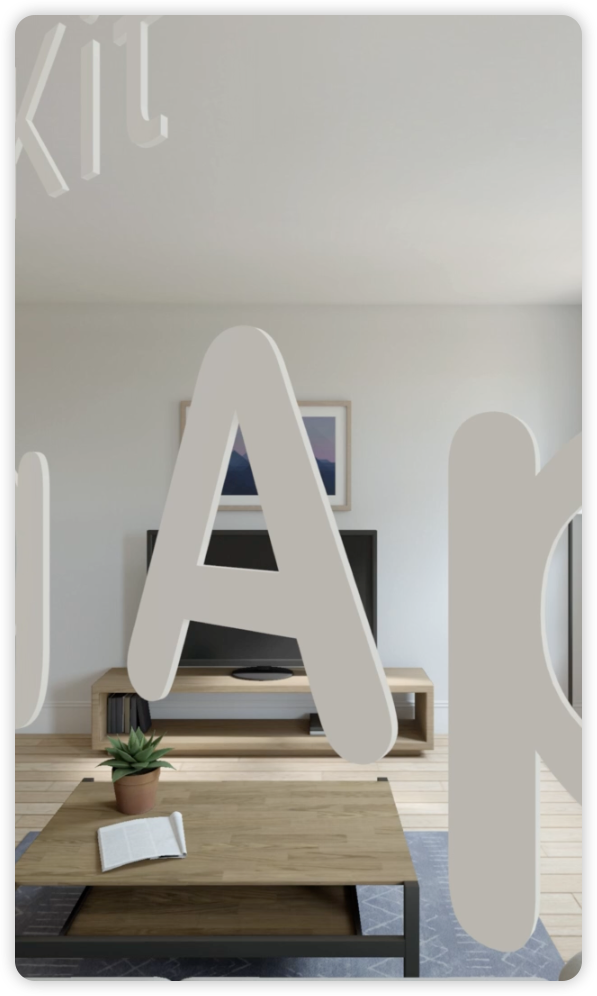 | 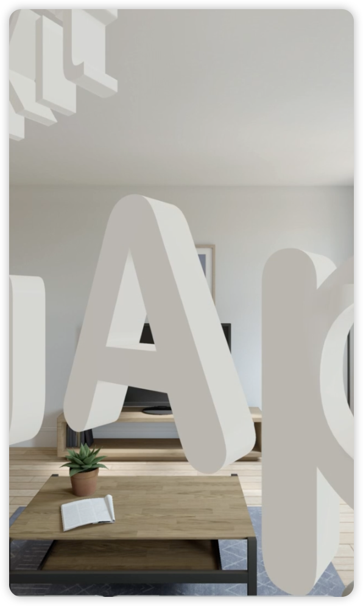 | 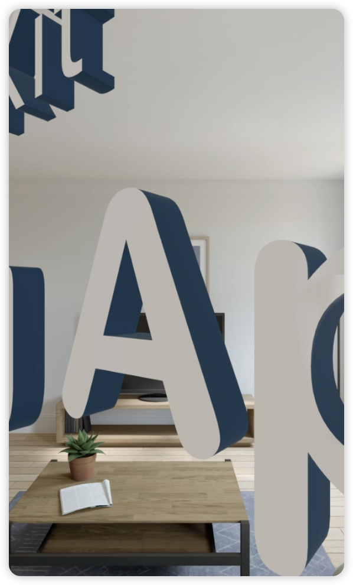 | 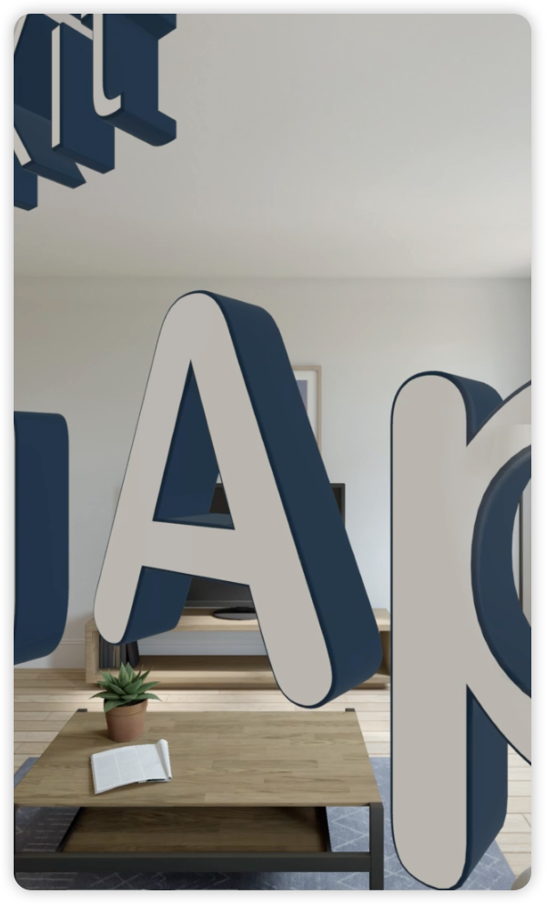 |
| :---------------------------------------------- | ----------------------------------------------- | ----------------------------------------------- | --------------------------------------------- |

App 还使用 MeshResource 挤压 SwiftUI Path 生成标志。SwiftUI Path 在定义形状方面有很大的灵活性：

```swift
// Use MeshResource(extruding:) to bring SwiftUI.Path to 3D

let graphic = SwiftUI.Path { path in
    path.move(to: CGPoint(x: -0.7, y: 0.135413))
    path.addCurve(to: CGPoint(x: -0.7, y: 0.042066),
                  control1: CGPoint(x: -0.85, y: 0.067707),
                  control2: CGPoint(x: -0.85, y: 0.021033))
    // ...
}

var options = MeshResource.ShapeExtrusionOptions()
// ...

let graphicMesh = try await MeshResource(extruding: graphic
                          extrusionOptions: options)
```

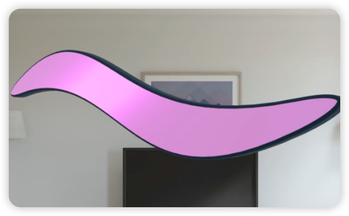

> 要了解有关 SwiftUI Path 的更多信息，请查看 SwiftUI 教程 [Drawing paths and shapes](https://developer.apple.com/tutorials/swiftui/drawing-paths-and-shapes)。

### 使用自定义格式创建和更新网格

现在让我们来看看启动画面的背景。为了构建它，我们使用了一个名为 [`LowLevelTexture`](https://developer.apple.com/documentation/realitykit/lowleveltexture?language=_2) 的全新 API。`LowLevelTexture` 提供与 `LowLevelMesh` 相同的快速资源更新能力，但仅适用于纹理资源。


在启动画面上，App 使用 `LowLevelTexture` 为药丸形状群生成某种形状描述，此形状描述存储在纹理的红色通道中。较暗的区域位于其中药丸的内部，而较亮的区域位于药丸外部。在纹理的绿色通道中，应用存储了启动画面晕影的描述。此纹理通过 Reality Composer Pro 中的 ShaderGph 着色器解释为最终图像。

| 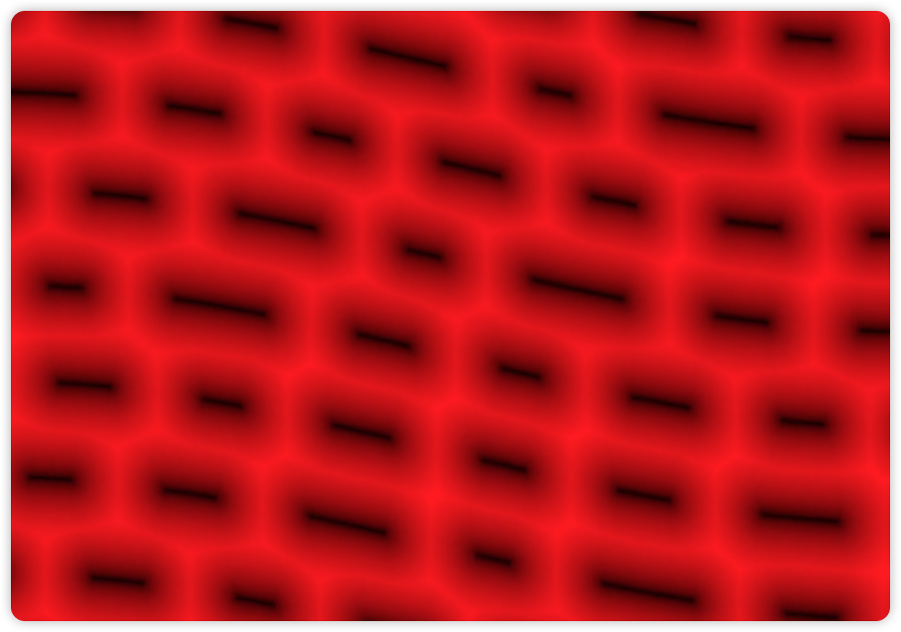 | 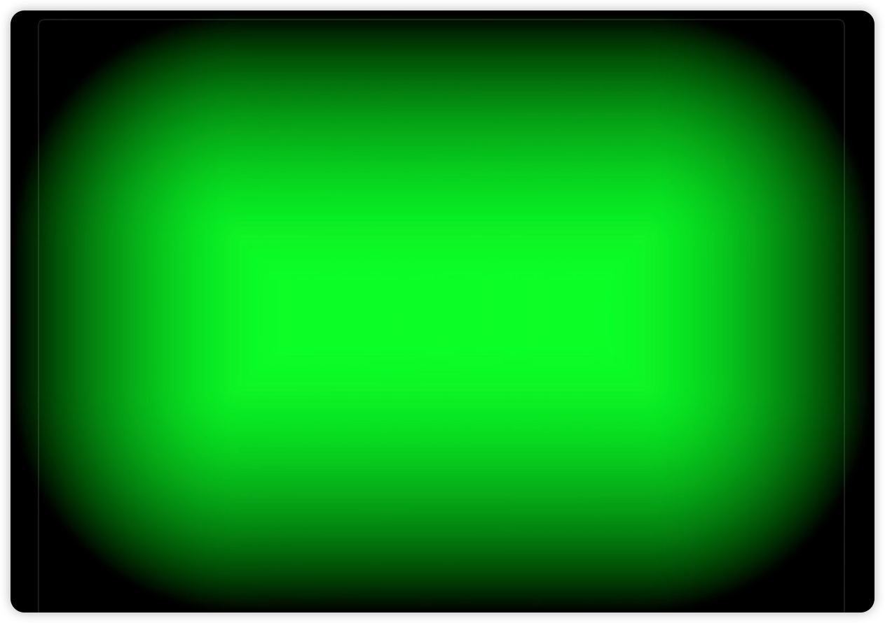 |
| ------------------------------------ | -------------------------------------- |

> 纹理的红色通道和绿色通道是图像中用于存储和表示颜色信息的组成部分。红色通道专门用于存储图像中红色的强度信息，绿色通道专门用于存储图像中绿色的强度信息。

我们可以从 `LowLevelTexture` 的 `Descriptor` 创建 `LowLevelTexture`。`Descriptor` 与 Metal 的 `MTLTextureDescriptor` 相当。与 `LowLevelMesh` 一样，`LowLevelTexture` 提供对像素格式和纹理使用的详细控制。对于启动画面，我们只需要红色和绿色通道，因此我们使用像素格式 `.rg16Float`：

```swift
let descriptor = LowLevelTexture.Descriptor(pixelFormat: .rg16Float,
                                            width: textureResolution, 
                                            height: textureResolution,
                                            textureUsage: [.shaderWrite, .shaderRead])
```

从 `Descriptor` 初始化 `LowLevelTexture` 后，从 `LowLevelTexture` 创建 RealityKit 纹理资源，将此纹理与材质一起使用：

```swift
let lowLevelTexture = try LowLevelTexture(descriptor: descriptor)
var textureResource = try TextureResource(from: lowLevelTexture)

var material = UnlitMaterial()
material.color = .init(tint: .white, texture: .init(textureResource))
```

我们可以在 GPU 上更新 `LowLevelTexture`，类似更新 `LowLevelMesh` 一样，设置 Metal 命令缓冲区和计算命令编码器:

```swift
let lowLevelTexture: LowLevelTexture

let commandBuffer: MTLCommandBuffer
let encoder: MTLComputeCommandEncoder
let computePipeline: MTLComputePipelineState

commandBuffer.enqueue()
encoder.setComputePipelineState(computePipeline)
```

接下来，使用命令缓冲区调用 [`replace(using:)`](https://developer.apple.com/documentation/realitykit/lowleveltexture/replace(using:)?changes=_3)，这将返回一个 Metal 纹理，我们可以在计算着色器中写入该纹理：

```swfit
// ...
let writeTexture: MTLTexture = lowLevelTexture.replace(using: commandBuffer)
encoder.setTexture(writeTexture, index: 0)
```

最后，调度 GPU 计算并提交命令缓冲区。当命令缓冲区完成时，Metal 纹理将自动出现在 RealityKit 中：

```swift
// ...
encoder.dispatchThreadgroups(/* ... */)
encoder.endEncoding()
commandBuffer.commit()
```

至此，独特的背景与个性化的 3D 几何图形相结合，使绘画 App 具有独特的外观。

## 五、总结

在本 Session 中，介绍了构建了一个交互式空间绘图 App 时使用的 RealityKit 新 API 。

1. 我们使用了 RealityKit 空间跟踪 API，以便应用程序可以检测用户在其空间中绘制的位置。
2. 我们使用 SwiftUI 和高级悬停效果来构建交互式空间 UI 以自定义画笔和样式。
3. 我们了解了 RealityKit 中的资源更新工作原理，并使用低级 API 以交互方式生成网格和纹理。
4. 我们使用新 API 导入 2D 矢量图形并使其具有空间感。


> 此外，欢迎查看以下 Session 以详细了解今年 RealityKit 中的新功能。
>
> 1. [Discover RealityKit APIs for iOS, macOS and visionOS](https://developer.apple.com/videos/play/wwdc2024/10103/)；
> 2. [Enhance your spatial computing app with RealityKit audio](https://developer.apple.com/videos/play/wwdc2024/111801/)。
