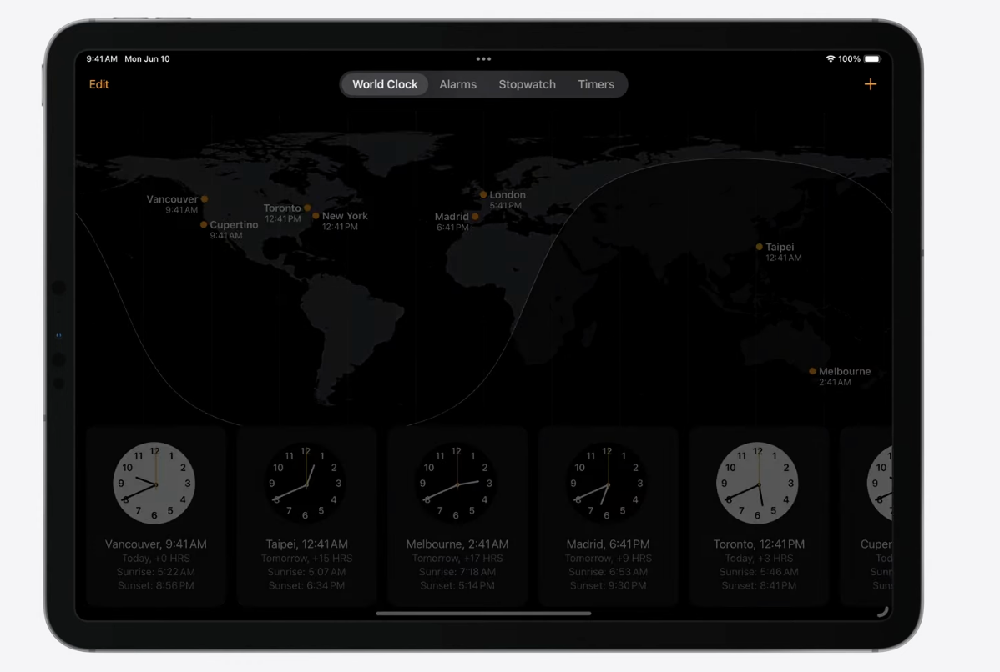
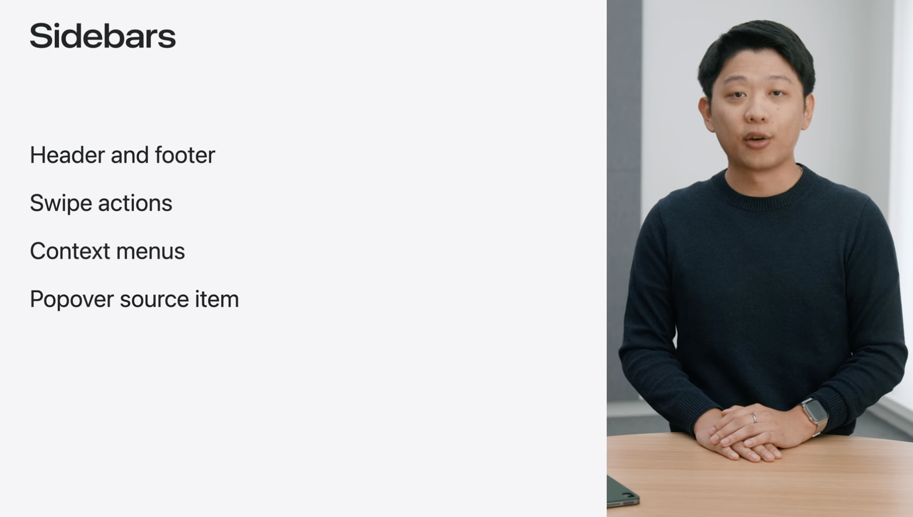
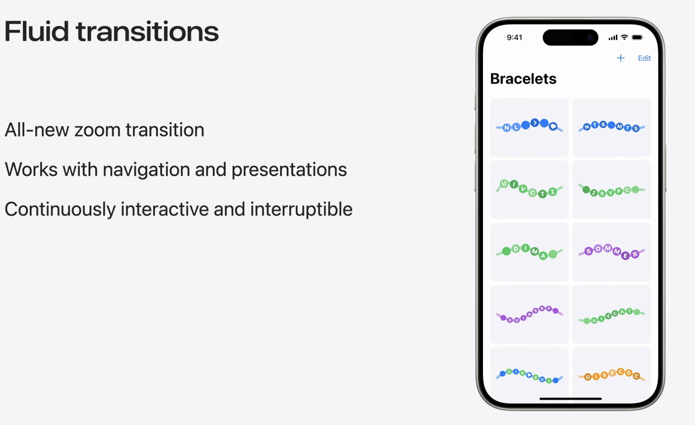
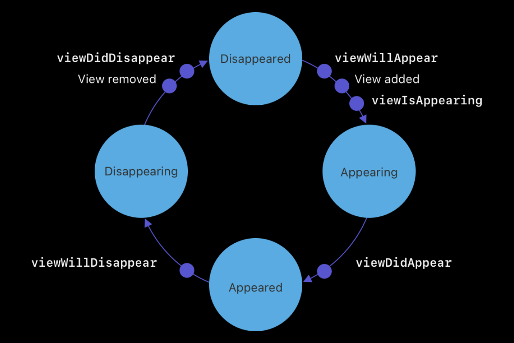
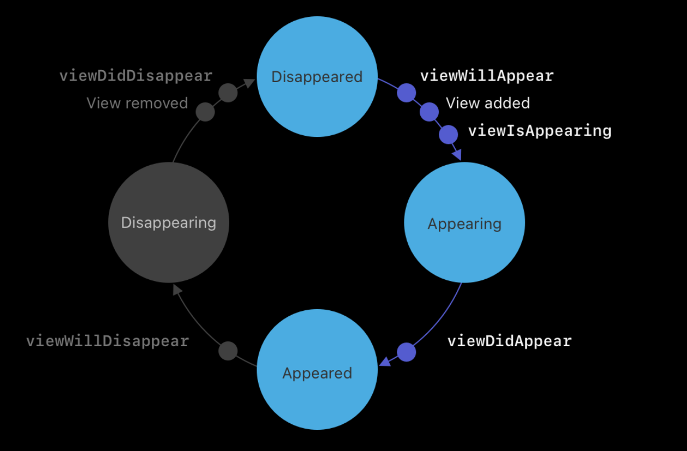
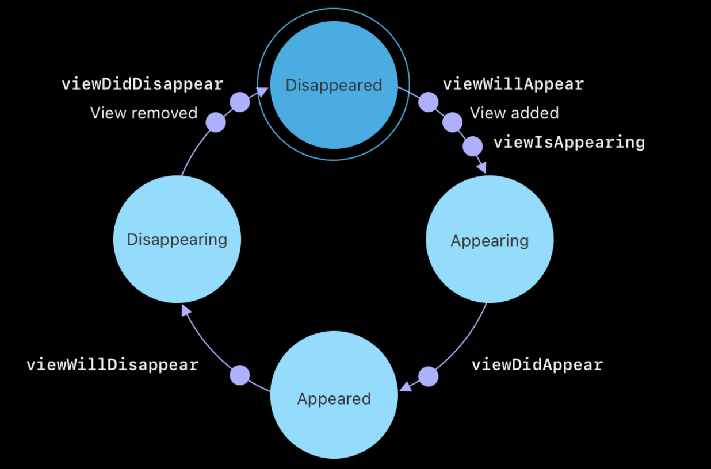

# WWDC24 10118 - UIKit 新功能

> 摘要: 本文主要介绍了iOS18中UIKit的一些更新，包括选项卡和文档启动体验、流畅的转场、文本和输入体验改进，同时还介绍了 UIKit 和 SwiftUI 动画和手势之间前所未有的互操作性，以及整个 UIKit 的一般性改进。

本文基于[Session 10118](https://developer.apple.com/videos/play/wwdc2024/10118/?time=163)进行梳理，感谢@Vong Sorry @ChengzhiHuang 两位老师的Review，感谢@SwiftOldDriver社区提供的机会。

> 作者:
>
> Sharker，一年iOS开发经验，目前在北京某国企负责支付SDK相关研发，对于UI展现与编译较为感兴趣，[Github](https://github.com/AkaShark)
>
> 审核:
>

UIKit 作为老牌的UI框架在很多应用场景中依然有着不可替代的作用，在 iOS 18 中UIKit 也迎来了一些新的改变，在观看完[Session 10118](https://developer.apple.com/videos/play/wwdc2024/10118/)后对我印象最大的新特性包括了新的缩放转场效果，UIKit与SwiftUI在动画与手势中的交互以及`UITextView`富文本的支持，从Apple iOS 18 的更新中看出来，UIKit除了常规的更新外越来越注重其与SwiftUI的交互。本文将按照[Session 10118](https://developer.apple.com/videos/play/wwdc2024/10118/)视频介绍新特性的顺序逐一的进行介绍，当然读者也可按照兴趣程度选择性阅读，每年的What's new in UIKit 其实更像是一个"Index"文件，其中会大概介绍涉及UIKit的新更新，然后引出一篇新的 Session ，在文章中我将尽可能的去补充引入的Session，但是因为篇幅和时间的原因可能介绍的并不是很完善，感兴趣的读者可以选择继续阅读对应 Session 的文章。

本文主要围绕以下三个部分展开介绍


1. UIKit 核心功能更新
2. UIKit 与 SwiftUI 交互
3. 常规功能增强

## UIKit 核心功能更新 - key features

### 重设计的文档启动体验 - Document lanunch experience
对于文档类的修改其实在WWDC23中的[What's new in UIKit](https://developer.apple.com/videos/play/wwdc2023/10055/)也有提及到，在iPadOS 17中，Apple改进了对文档应用程序的支持，UIKit提供了一个新的`UIDocumentViewController`作为内容视图控制器的基类，具体可以回看下[WWDC23 Build better document-based apps](https://developer.apple.com/videos/play/wwdc2023/10056)。

在WWDC24中Apple将基于`UIDocumentmentViewController`的文档启动页进行了新的设计，将文档类启动页进行了结构化的设计。

> 页面样式的头部分可以添加前景资源与后景资源


> 同时页面样式的头部分可以添加背景色，设置包括背景色、渐变色、图片等


> 页面样式的中间部分为标题部分


> 页面样式标题下面的部分为主Button，标示着文档应用想要表达的首要行为


> 页面样式主Button下面的部分为次Button，标示着文档应用想要表达的次要行为


> 页面样式最下面的部分为文档浏览区域

想要使用新的启动页样式，则需要将`UIDocumentViewController`设置为根视图，将原本设置为根视图的`UIDocumentBrowserViewController`替换掉。


当然也可以通过iOS 18更新的API来完成更多自定义的样式，具体的细节可以阅读以下两个Session
[WWDC23 Build better document-based apps](https://developer.apple.com/videos/play/wwdc2023/10056)。
[Evolve your document launch experience](https://developer.apple.com/videos/play/wwdc2024/10132/)

### 标签栏和侧边栏的视觉更新 - Tab and sidebar refresh
标签栏和侧边栏的应用更多是在iPadOS上，在[WWDC23 What's new in UIKit](https://developer.apple.com/videos/play/wwdc2023/10055/)中也有对于侧边栏的更新，在WWDC23 iOS17中为侧边栏提供了新的行为，侧边栏可以自动，当页面宽度减小时，会根据需要隐藏侧边栏，如果在点击侧边栏按钮时没有足够的空间进行平铺，会以覆盖或者位移方式显示次要列与侧边栏，开发者可以使用`preferedDisplayMode`和`preferredSplitBehavior`在应用程序中覆盖此行为。


在WWDC24中，Apple不但针对于侧边栏进行了优化增加了新的自定义能力同时对于标签栏的UI样式进行了优化。新的标签栏采用了更紧凑的外观，减少了垂直和水平的空白空间，并将其整体浮于应用上其位置和顶部的安全区进行了融合。


对于侧边栏来说，现有的侧边栏应用可以采用新的`UITabBarController`API来获取组合标签栏和侧边栏的新体验。这种组合标签栏与侧边栏在开发中是常见的需求，具体来说是在最小化侧边栏的时候侧边栏会以动画的形式变成选项卡栏展示，从功能上通过侧边栏可以访问应用的更多功能，标签栏可以对应用主要的功能进行快速切换，从体验上在侧边栏变为标签栏展示时可以让应用的主体内容更加突出。


使用新的侧边栏API还提供了自定义的能力，可以通过拖拽的方式来自定义侧边栏和标签栏具体功能项的位置与是否展示。


要使用上述功能需要使用新的`UITab`和`UITabGroup` API


通过这些API可以将应用中标签栏与侧边栏进行结构化的描述。此外这些API还兼容了多平台，包括了Mac Catalyst和VisionOS，想要了解更多内容可以阅读[Elevate your tab and sidebar experience in iPadOS](https://developer.apple.com/videos/play/wwdc2024/10147/)。


在这篇Session具体介绍了在Tab bar 和 sidebar在UIKit中的更新，以及Sidebar中一些新的API。



> 在这篇Session中以iPad中的时钟应用介绍了标签栏的新样式，以iPadOS上的Apple TV介绍了侧边栏与标签栏的结合，同时在这篇Session也给出了关于使用Tab bar 与 sidebar 的一些实践推荐


### 全新的转场效果: 缩放转场 - Fluid transitions
在iOS18，UIKit提供了一种新的转场方式-缩放转场(Zoom Transition)，它适用于通过push或者present的方式进行转场，缩放转场不仅仅是一种视觉的优化，同时它也可以进行持续的交互，允许使用者通过拖拽的方式移动(缩放转场类似于Apple Store 中的转场动画，这种转场在github上也有通过缩放动画去模拟实现的例子，在WWDC24中UIKit去提供了相应的API)。在日常的开发中，从cell跳转到其他页面使用缩放转场，可以通过在转场的过程中保持相同的UI来增加应用视觉上的连贯性。




在Apple的文档中是这样介绍缩放转场
> iOS 18 introduces a fluent, continuously interactive zoom transition. You can use this transition when your app navigates from a large cell or thumbnail to increase the sense of continuity in your app. People can then grab, drag, and control the transitions when they begin and anytime during their animation.

可以看出Apple对于缩放转场的定位是为了提高程序的连续性的，在使用缩放转场的时候用户点击缩略图或者cell的时候，应用会将相应的ViewController推送到导航栈的栈顶，在这个过程中用户可以停止转场、拖动视图来完成转场或者恢复原状态，转场的状态与动画会随着用户的手势进行相应的变化。缩放缩放转场可以在iPhone与iPad上使用，也包括了在visionOS中运行的iPad应用，在其他平台API是可用的，但是其表现形式会根据当前平台切换为默认的转场。

#### 如何使用
要使用缩放转场首先需要在要push到的新ViewController中将`preferedTransition`属性设置为`zoom(option: sourceViewProvider:)`，其次传递一个返回要缩放的视图的闭包，最后通过`pushViewController`将新ViewController展示出来。

```swift
// Create a detail view controller for the selected item.
let detailViewController = MyDetailViewController(itemID: itemID)


// Set the preferred transition to zoom.
detailViewController.preferredTransition = .zoom { [self] _ in
    
    // Return the thumbnail view for the selected item.
    return thumbnail(for: itemID)
}


// Push the detail view controller onto the navigation stack.
navigationController?.pushViewController(detailViewController, animated: true)
```

> [!IMPORTANT]
> 
> 由于缩放转场过程中需要对于缩放视图不断进行放大与缩小，因此需要使用稳定的(不要轻易锁着程序状态而改变的)标识符在闭包中查找视图，而不是捕获UIVIew或者IndexPath实例。

还有一点需要注意的是如果我们的入口页面是一个轮播图，在我们点击任意一个项进入详情页后，我们上一个页面的轮播图还在滚动，这时我们回退当前的页面，可能会导致想要缩放回的项发生变化，为了找到了正确的项，我们需要使用系统传递给闭包的上下文。

``` swift
// Create a detail view controller for the selected item.
let detailViewController = MyDetailViewController(itemID: itemID)


// Set the preferred transition to zoom.
detailViewController.preferredTransition = .zoom { context in
    
    // Use the context to determine the current item.
    guard let controller = context.zoomedViewController as? MyDetailViewController else {
        fatalError("Unable to access the current view controller.")
    }
    
    // Return the thumbnail for the current item.
    return self.thumbnail(for: controller.itemID)
}


// Push the detail view controller onto the navigation stack.
navigationController?.pushViewController(detailViewController, animated: true)
```

#### 状态流转
作为开发者可能还有一点需要关心，由于缩放视图是跟随着用户的手势进行变化的，从点击到视图出现在栈顶期间ViewController可能会经历大量的状态变更，对于这些状态的变更具体的流转流程是什么呢？


在ViewController push进导航堆栈或者pop出导航堆栈的过程中会经历以下几个状态变更，以下例子是ViewController push进入导航堆栈，ViewController由开始的消失状态变为出现状态。


ViewController会经历以下几个步骤
1. 调用`viewWillAppear`
2. 将ViewController对应的View添加到视图层级结构中
3. 调用`viewIsAppearing`
4. 通过转场动画过渡到Appear状态
5. 调用`viewDidAppear`
6. 视图出现结束入栈流程

其中`viewIsAppearing`这是在[WWDC23](https://developer.apple.com/videos/play/wwdc2023/10055/)中What's new in UIKit介绍的ViewController生命周期中的新API，`viewIsAppearing`是在`viewWillAppear`与`viewDidAppear`之间新增的一个生命周期回调，`viewIsAppearing`是每次视图出现执行操作的最佳位置，也就是操作依赖于视图的初始集合属性(包括大小、位置等)的最佳回调时机，因为在此时ViewController已经完成了初始化，View也已经添加到了视图层级结构体中并由父视图进行了布局。


当ViewController从导航堆栈中pop的时候，他会以出现状态开始，然后执行以下步骤
1. 调用`viewWillDisappear`
2. 通过转场动画过渡到DisAppear状态
3. 从视图层级结构中删除视图
4. 调用`viewDidDisappear`
5. 视图移除结束出栈流程

//TODO: 上面写的变成事件
由于在缩放转场中用户可以关于跳转流程，如果用户主动打缩放流程，以上事件的顺序将会发生变化。


当用户触发了pop，紧接着又取消pop操作，系统会调用`viewWillDisappear`切换到Disappearing状态然后直接切换到Appearing状态并调用`viewDidAppear`，然后以Appeared状态结束，状态的装换发生在一个RunLoop循环中，因此不会被打断。



当用户触发push，紧接着又取消push操作，系统不会取消这次push操作，取而代之的系统会在一个RunLoop循环内完成到Appeared状态，然后执行pop操作，之后的流程和上述中断pop操作一致。

> [!IMPORTANT]
> 系统以不同的方式处理push和pop转换。在处理push的时候，其不会取消push，而是将其转换为pop。这确保ViewControlle达到出现状态，并调用出现和消失回调的完整周期。


## UIKit 与 SwiftUI 交互 - UIKit and SwiftUI interoperability
iOS18 增强了SwiftUI与UIKit的交互，
### 动画 - Animations

### 手势 - Gesture recognizers

## 常规功能增强 
### 自动特征跟踪 - Automatic trait tracking
### 列表视图改进 - List improvements
### 定期UI更新刷新 - Update link
### SF Symbol 动画 - Symbol animations
### 感官反馈 - Sensory feedback
### 文本格式化拓展 - Text improvements
### 菜单操作 - Menu actions
### Apple 触控笔 Apple Pencil

## 总结


## Ref
[Enhancing your app with fluid transitions](https://developer.apple.com/documentation/uikit/animation_and_haptics/view_controller_transitions/enhancing_your_app_with_fluid_transitions?language=objc)
