# WWDC24: Session 10135 - What's new in Xcode 16

## 简介

每年，让 Apple 平台的开发者们兴奋不已的无疑是 WWDC 带来的众多新颖且有趣的新特性。同时，作为开发者的我们，也不能忽视陪伴我们已久的 Xcode，这次它也迎来了全新的版本 —— Xcode 16。这个版本的大量更新将优化我们的开发体验并提升工作效率。接下来，就让我们从 `Edit`，`Build`，`Debug`，`Test`，`Profile` 等几个方面来探索新版本中那些令人振奋的新特性。

以下内容基于 [Session 10135](https://developer.apple.com/videos/play/wwdc2024/10135/) 整理


## TL;DR

- Edit
  - 为 Swift 代码带来了预测式代码补全，限制 macOS 15 + 16GB 运行内存，大模型约 2GB
  - Swift 6 编译期提供严格的数据隔离和数据竞争的安全检查
  - 实时预览优化
    - `@Previewable` 使用内联动态属性进行预览
    - `PreviewModifier` 使预览时构建复杂数据以及实现数据复用变得更容易
    - 预览的性能和响应更快
- Build
  - 显式模块构建提供了更高效稳定的构建系统，Swift 需要手动开启 `Explicitly Built Modules`
- Debug
  - 调试器速度更快
  - 调试符号改进，文件体积更小，符号查找速度更快
  - 线程性能检查器增加过多磁盘写入的诊断以及应用启动速度缓慢的诊断，组织者报告新增启动缓慢报告
  - 新增统一回溯视图，更高效预览调用栈附近的代码
  - 新增 RealityKit 调试器，3D 形式展示层次结构的快照，更高效直观
- Test
  - 全新开源 Swift Testing 框架
- Profile
  - Instruments 新增火焰图
- Others
  - iOS 应用图标新样式
  - `@DebugDescription` 为 LLDB 提供类型的摘要描述

## Edit

### 预测式代码补全

历年来，苹果的工程师们不断优化 Xcode 代码补全的能力，如今终于迎来了新时代。得益于预测式代码补全引擎，苹果专门针对 Swift 和 Apple SDKs 训练了一个独特的模型，它可以考虑函数名称和注释等代码上下文，更快地理解开发者的想法，提供更全面的代码建议。苹果承诺为了保护隐私，整个过程只在本地运行，且支持离线运行。

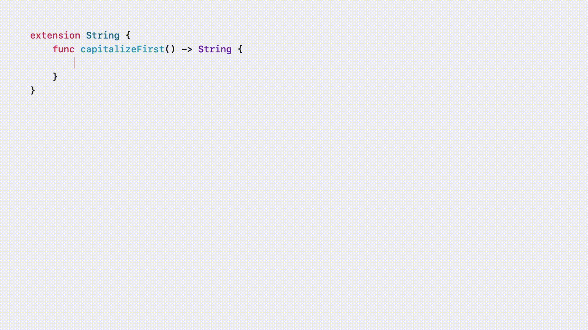

若要开启该功能，需要打开 Xcode → Settings → Text Editing → Editing，勾选 `Predictive code completion`，之后 Xcode 会下载基于最新代码训练的模型，目前模型大小约  2GB 左右，从描述上看，只能为 Swift 代码提供预测式补全的能力。

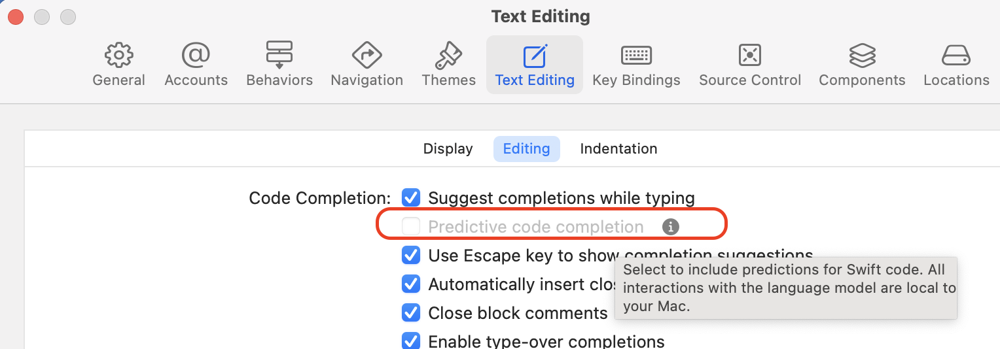

目前 (Xcode 16 beta 2) 需要使用拥有 16GB 或以上运行内存的 Apple Silicon 的 Mac，且运行 macOS Sequoia  时才可用。遗憾的是国行的 Mac 暂时无法使用该功能，不过，我相信苹果不会忽视国内开发者们的需求，期待它早日到来。

### Swift 6 严格的数据隔离和数据竞争的安全检查

Swift 6 带来了一种新的保证并发安全的语言模式，它将通常只在运行时才能暴露的数据竞争变为编译时的问题，这将显著提高我们代码的正确性和安全性。关于现阶段 Swift 代码中的隐患，我们无需过于担忧，编译器提供了逐步改进的方法。

打开项目的 Build Settings，我们依然保持配置 Swift language version 为 Swift 5。找到 Swift Compiler - Upcoming Features 一项，其中有很多标注为 `No - $(SWIFT_UPCOMING_FEATURE_6_0)` 的选项，例如我们可以先将 `Isolated Global Variables` 设置为 `YES`，如图。

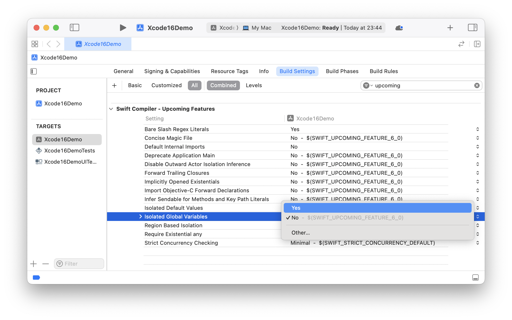

这样，项目中的一些未正确隔离的全局变量将会被标记为警告，这并不影响项目的正常构建和分发，这将允许我们逐步迁移到 Swift 6，当我们将所有相关警告修复完毕后，最终可以将 Swift language version 设置为 Swift 6。

关于迁移至 Swift 6 的更多信息和方法，可以参看 [Session 10169 - Migrate your app to Swift 6](https://developer.apple.com/videos/play/wwdc2024/10169/)。

### 实时预览优化

在去年，Xcode 15 为我们带来了 `#Preview` 宏，可以更快速更高效地进行预览，甚至可以预览 `UIKit` 中的 `UIView`、`UIViewController`，这极大地提升了我们的开发效率。在今年 Xcode 16 又为我们带来了两项新特性：`@Previewable` 和 `PreviewModifier`。

首先来看一下 `@Previewable` 是做什么的，如下代码中编写了一个播放按钮，根据当前的播放状态展示不同的图标：

``` swift
struct PlayButton: View {
    @Binding var isPlaying: Bool
    var body: some View {
        Button(action: {
            self.isPlaying.toggle()
        }) {
            Image(systemName: isPlaying ? "pause.circle" : "play.circle")
        }
    }
}
```

在 Xcode 15 中，我们需要为 `Binding` 创建数据源，即封装一层 `View` 并为其提供 `@State` 才可以预览：

``` swift
struct PlayButtonWrapperView: View {
    @State var isPlaying = false

    var body: some View {
        PlayButton(isPlaying: $isPlaying)
    }
}

#Preview {
    PlayButtonWrapperView()
}
```

如今，拥有了 `@Previewable` 我们可以更简单地通过内联动态属性进行预览：

``` swift
#Preview {
    @Previewable @State var isPlaying = true
    PlayButton(isPlaying: $isPlaying)
}
```

另外，在使用 `@Previewable` 时，我发现一项 `#Preview` 并未在文档中说明的改进，通过展开宏对比 Xcode 15 和 16 可以发现：

``` swift
// Xcode 15
struct $XXX_XXX_15PreviewRegistryfMu_: DeveloperToolsSupport.PreviewRegistry {

    static func makePreview() throws -> DeveloperToolsSupport.Preview {
        DeveloperToolsSupport.Preview {
            ...
        }
    }
}
```

``` swift
/// Xcode 16
struct $code16_XXX_15PreviewRegistryfMu_: DeveloperToolsSupport.PreviewRegistry {

    static func makePreview() throws -> DeveloperToolsSupport.Preview {
        DeveloperToolsSupport.Preview {
            func __b_buildView(@SwiftUI.ViewBuilder body: () -> any SwiftUI.View) -> any SwiftUI.View {
                body()
            }
            return __b_buildView {
                ...
            }
        }
    }
}
```

在 Xcode 16 中使用了 `ViewBuilder` 来优化了 Preview 的 `body` 的构建体验，正是如此，我们可以在 Xcode 16 中 Preview 多个 `View` 而不必使用 `Group` 进行嵌套：

``` swift
#Preview {
    PlayButtonWrapperView(isPlaying: true)
    PlayButtonWrapperView(isPlaying: false)
}
```

以及如下代码可以编译通过，而不需要编写 `return`：

``` swift
#Preview {
    @Previewable @State var isPlaying = true
    PlayButton(isPlaying: $isPlaying) // 这里可以省略 return
}
```

关于 `ViewBuilder` 是 SwiftUI 中 View 构建的核心，其利用了 Swift 5.4 中的特性 `@resultBuilder` (前身是 `Function Builder`)，使得我们可以更简洁的根据一组表达式来构建数据，感兴趣可以参考文档 [Result Builders](https://docs.swift.org/swift-book/documentation/the-swift-programming-language/attributes/#resultBuilder)。

接着，来看看 `PreviewModifier` 是如何帮我们提升效率的。有时，需要预览的 `View` 依托较为复杂的数据，或者数据的获取有一定的代价，例如下面的 `View` 中，数据 `namer` 需要从网络中获取：

```swift
struct RobotNameSelectorView: View {
    @Environment(RobotNamer.self) private var namer
    var body: some View {
        ...
    }
}
```

为了使预览时，更容易构造复杂的数据，也为了使得数据可以更方便地复用，SwiftUI 新增了 `PreviewModifier` 协议，使用此协议需要实现两个方法：

1. 实现静态方法 `makeSharedContext()` 来创建共享上下文 `Context`，即编写复杂数据的创建逻辑；
2. 使用 `body(content:context:)` 方法为预览的 `View` 注入上下文 `Context` 即注入复杂数据。

在这里，我们通过 `PreviewModifier` 为 `RobotNameSelectorView` 提供一组测试数据：

```swift
struct SampleRobotNamer: PreviewModifier {
    typealias Context = RobotNamer
    
    static func makeSharedContext() async throws -> Context {
        // 在这里将测试数据保存至本地为了更方便的获取
        let url = URL(fileURLWithPath: "/tmp/local_names.txt")
        return try await RobotNamer(url: url)
    }
    
    func body(content: Content, context: Context) -> some View {
        // 使用 environment modifier 传递数据
        content.environment(context)
    }
}
```

接着，就可以通过 `PreviewTrait` 来使用这个 `PreviewModifier` 了：

``` swift
#Preview(traits: .modifier(SampleRobotNamer())) {
    RobotNameSelectorView()
}
```

接着，为了方便数据复用，可以对 `PreviewTrait` 编写扩展，提供静态的 `PreviewModifier`：

```swift
extension PreviewTrait where T == Preview.ViewTraits {
    @MainActor static var sampleNamer: Self = .modifier(SampleRobotNamer())
}
```

这样，在预览中使用 `PreviewModifier` 代码如下：

```swift
#Preview(traits: .sampleNamer) {
    RobotNameSelectorView()
}
```

通过这种方式为预览提供数据时，不仅可以减少重复代码，还可以使不同的预览重用这些数据。特别的，`PreviewModifier` 可以跟 `SwiftData` 非常好的结合：

现有一个旅行计划的应用，其所有页面的数据依赖于由 `SwiftData` 保管的旅行计划 `Trip` 模型的数组：

```swift
struct ContentView: View {
    @Query
    var trips: [Trip]
    
    var body: some View {
        ...
    }
}
```

接着我们创建一个 `PreviewModifier`：

```swift
struct SampleData: PreviewModifier {
    static func makeSharedContext() throws -> ModelContainer {
        let config = ModelConfiguration(isStoredInMemoryOnly: true)
        let container = try ModelContainer(
            for: Trip.self,
            configurations: config
        )
        SampleData.createSampleData(into: container.mainContext)
        return container
    }
    
    func body(content: Content, context: ModelContainer) -> some View {
        content.modelContainer(context)
    }
}
```

并添加扩展 `PreviewTrait`，方便多处调用：

```swift
extension PreviewTrait where T == Preview.ViewTraits {
    @MainActor static var sampleData: Self = .modifier(SampleData())
}
```

这样，所有预览的创建将变得非常简洁：

```swift
#Preview(traits: .sampleData) {
    ContentView()
}
```

关于 `SwiftData` 以及 `PreviewModifier` 和 `SwiftData` 的结合更多的内容可以参考 [Session 10137 - What's new in SwiftData](https://developer.apple.com/videos/play/wwdc2024/10137/)。

除了 API 方面的更新，得益于编译器、构建系统和操作系统的升级，`Preview` 现在不再需要生成一个独立的构建产物，而是可以复用整个项目的构建产物，这极大地提升了 `Preview` 的响应速度。

## Build

### 显式构建模块

Xcode 16 通过显式构建模块 (explicitly built modules) 大幅提升了构建效率。这项新特性提供了更优的并行处理能力，更出色的诊断功能，以及更快的调试速度。以上这些完全不需要我们修改任何一行代码，这是怎么做到的呢？

我们先看看之前的隐式模块构建，由于 Xcode 并行化的构建系统，每个子编译任务，可能都会隐式地遇到代码中依赖其他模块的情况，如果某个子任务碰巧遇到了某个依赖的模块，那么将由这个子任务对其进行编译。整体上，子任务在发现依赖模块时可能会遇到三种情况，模块还未被编译、模块正在编译中、模块已经编译完成。相应的，子任务会分别开始编译该模块，挂起等待该模块编译完成，复用该模块的编译结果。这便是隐式模块构建。

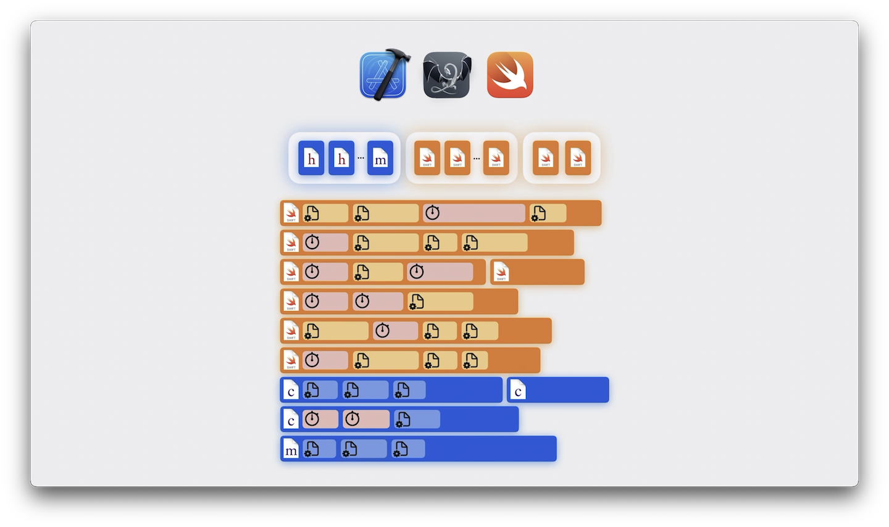

Xcode 16 通过显式构建模块改变了这一点，Xcode 拆分了每个源文件的编译流程，分为三个阶段：扫描依赖、构建依赖模块、构建源代码。

整体上，Xcode 扫描每个源文件，为整个项目建立模块依赖结构图，甚至可以跨 Target 来分析依赖，实现模块共享。接着规划编译任务，根据依赖图编译依赖模块，最后执行原始编译任务。

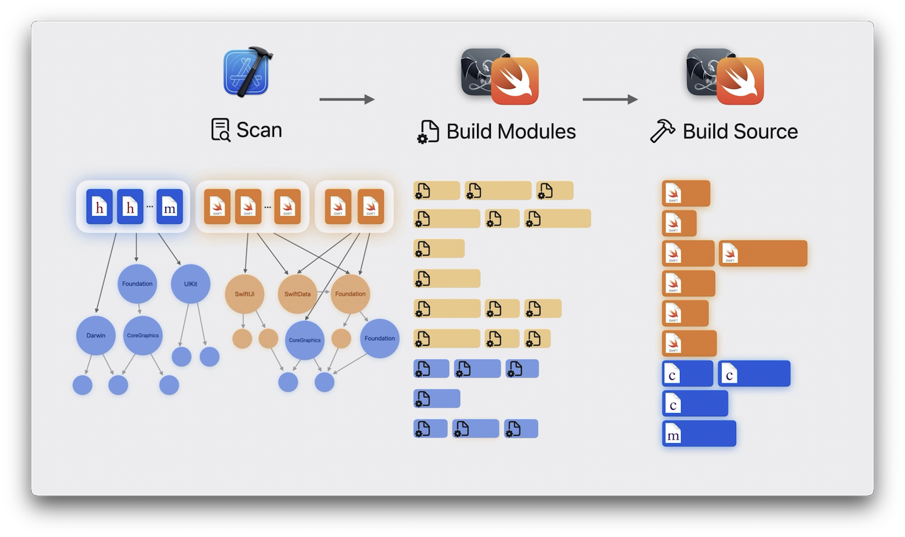

整体流程如下图：

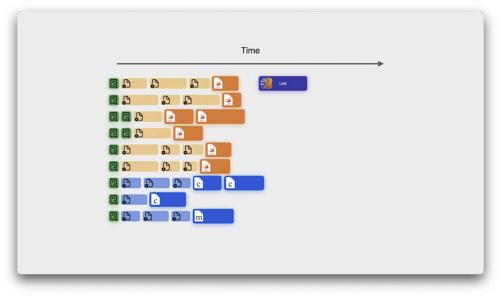

通过这一项改进，带来的好处是：

1. 有了精确且确定的模块依赖和共享的关系图，使得构建系统更加稳定可靠；
2. 由于构建系统完全理解模块之间的依赖关系和共享关系，可以作出更优的调度规划，从而提高构建效率；
3. 调试器可以重用构建的模块，启动速度得到了极大地提升。

另外，随着 Xcode 16 中 Swift Package 的改进, 构建任务可以先开始，而不必等待 Package 解析完成。

需要说明的是，在 C 和 Objective-C 中，这项功能是默认开启的，而 Swift 目前没有默认开启，需要我们手动开启，打开项目的 Build Settings，通过筛选或直接找到 Swift Compiler - General 中的 `Explicitly Built Modules`，将其设置为 `YES` 即可。

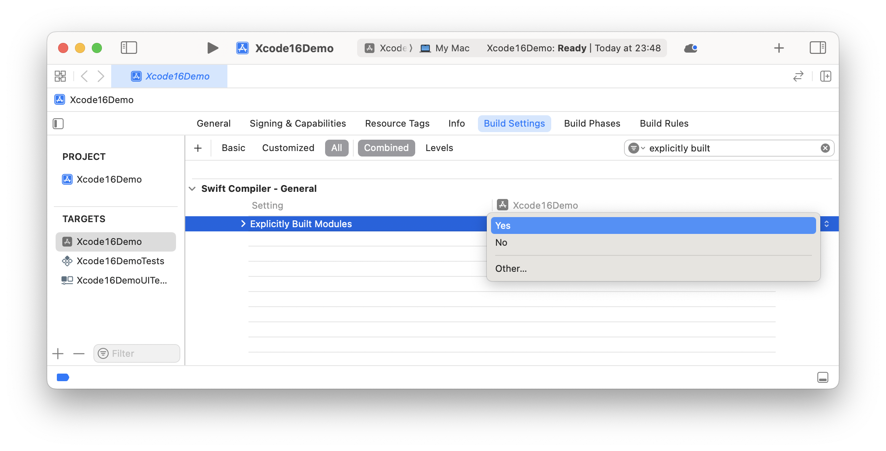

关于显式构建模块感兴趣可以参考 [Session 10171 - Demystify explicitly built modules](https://developer.apple.com/videos/play/wwdc2024/10171/) 了解更多，例如，究竟什么是模块，如何通过查看构建日志深入了解整个构建过程，为什么同一个依赖的模块会构建出多个变体，如何减少变体个数等。

## Debug

### 更快的调试器

正因为显式构建模块，使得调试器也能更容易地复用编译的模块，使其可以更快地启动，更快地响应。

### 调试符号信息改进

当**编译目标为 macOS Sequoia 或者 iOS 18 时**，默认会使用 DWARF 5 格式，这使得调试符号信息文件更小，符号查找速度更快。即就算使用 Xcode 16 构建，调试符号信息依然还是使用 DWARF 4 格式，只有将 `Minimum Deployments` 改为 iOS 18 时才会使用 DWARF 5 格式。距离我们享受这项优化，可能还需要一段时间。

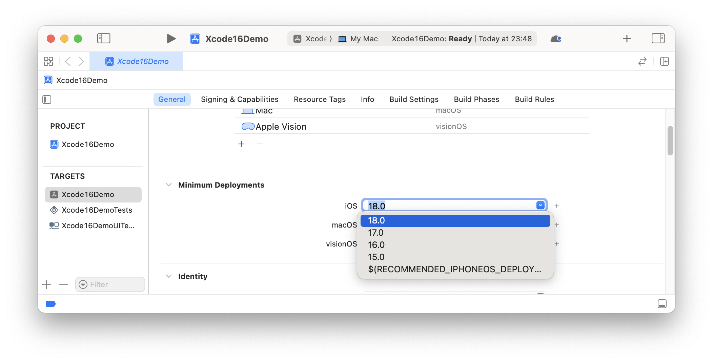

### 线程性能检查器和组织者报告

除了之前带来的主线程卡顿检测以及优先级反转检测之外，Xcode 16 还带来了过多磁盘写入的诊断，以及应用启动速度缓慢的诊断，以帮助我们更好地优化应用性能。

并且，在 Xcode Organizer (Cmd+Shift+Option+O) 中的 Reports 一项增加了 Launches 诊断信息，可以展示应用启动过程中，最慢的一段调用栈的符号信息。经过测试发现，使用 Xcode 15 构建的包也能在 Xcode 16 的 Organizer 中查看 Launches 诊断信息。

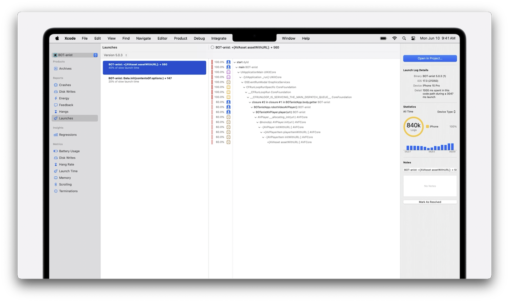

### 统一回溯视图

在调试时，可以通过点击底部调试栏中的开启回溯视图功能来容易地追踪调用栈信息，只需要在一个页面中就可以查看当前调用栈周围的代码，在所有的调用帧中，都可以通过鼠标悬停来查看变量的值。另外，还可以通过拖拽每一个调用帧视图左下角的按钮，可以查看调用附近更多的代码。

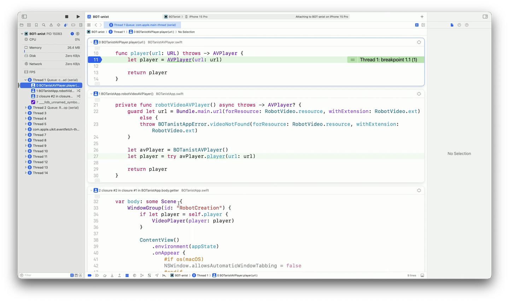

### 其他

Xcode 16 使用新的 RealityKit 调试器，可以捕获正在运行的应用中实体层次结构的快照，并以 3D 形式进行展示。关于 Xcode 16 在调试器方面更新的更多内容，可以查看 [Session - 10172: Break into the RealityKit debugger](https://developer.apple.com/videos/play/wwdc2024/10172/) 以及 [Session - 10198: Run, Break, Inspect: Explore effective debugging in LLDB](https://developer.apple.com/videos/play/wwdc2024/10198/)

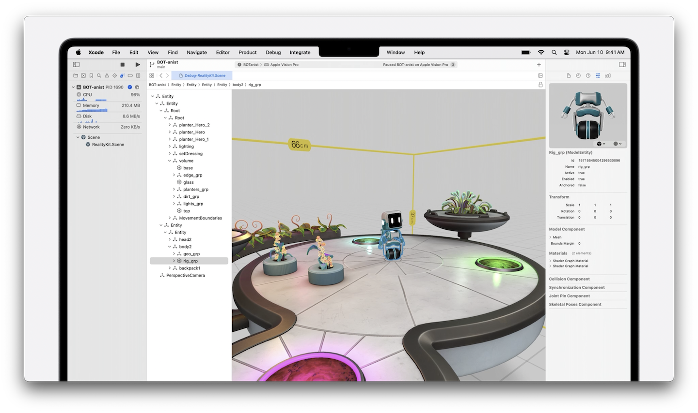

## Test

就像调试是我们开发中的好帮手一样，测试是能帮我们提前发现问题的好方法。关于测试，这次更新带来了全新的开源框架 [Swift Testing](https://github.com/apple/swift-testing)，它可以跟项目中现有的 `XCTest` 一起运行。

现在，不再需要继承 `XCTestCase` 的类，只需要 `@Test` 宏就可以快速添加一个测试，并且会在 Xcode 的导航中展示：

```
import Testing
@testable import BOTanist

@Test func plantingRoses() {
    ...
}
```

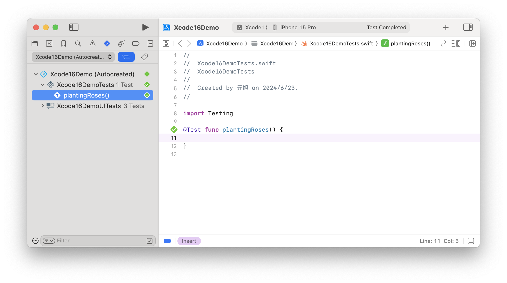

以一个简单的种植玫瑰的场景为例，使用 `#expect` 宏来进行验证种植结果是否和预期一致：

``` swift
@Test func plantingRoses() {
    let plant = ...
    let expected = ...
    #expect(plant == expected)
}
```

通过 Swift Testing，可以在测试未通过时查看更详细的信息。

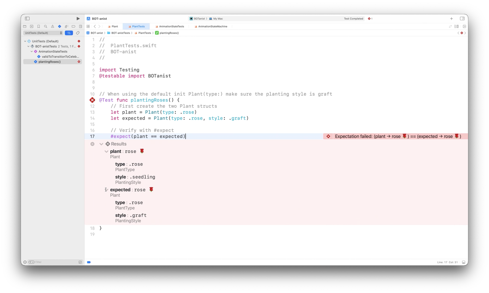

另外，`@Test` 宏还可以支持参数列表，如下代码用来测试给定的状态是否可以流转到状态 `.celebrate`：

``` swift
@Test(arguments: [AnimationState.idle, AnimationState.plant, AnimationState.walkLoop])
func validToTransitionToCelebrate(from state: AnimationState) async throws {
    #expect(state.isValidNextState(.celebrate))
}
```

这样 Xcode 可以并行运行三个测试，分别判断 `.idle`，`.plant`，`.walkLoop` 是否能通过测试，并且可以在测试失败时清晰地看到具体是哪个参数测试失败，以及可以单独运行某一个参数的测试。

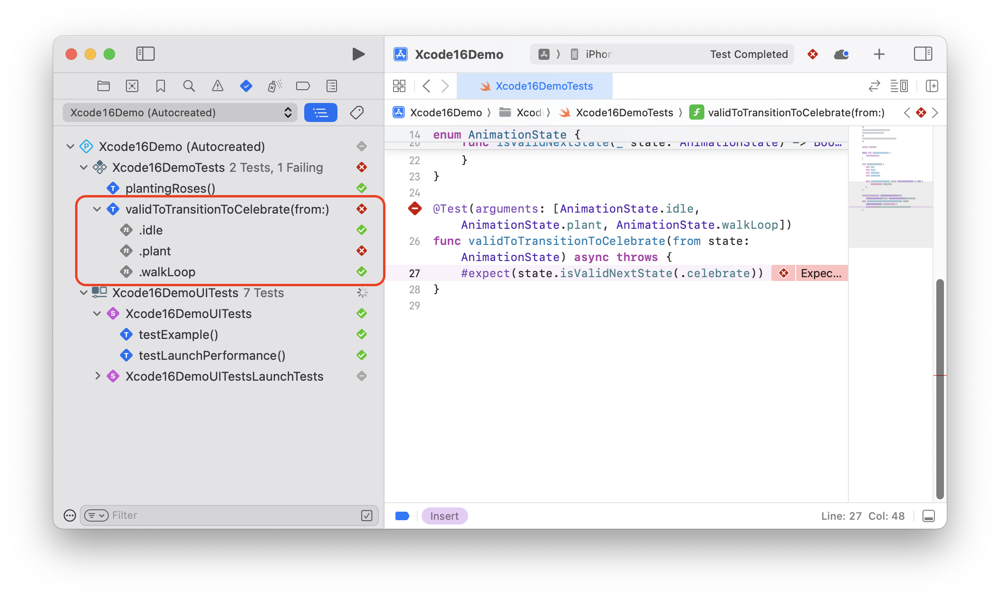

最后，还可以使用 `@Tag`，`@Suite` 来更好地管理测试集，关于 Swift Testing 如果想了解更多，可以结合 [WWDC24 内参](https://xiaozhuanlan.com/topic/5946873021) 来观看 [Session 10179 - Meet Swift Testing](https://developer.apple.com/videos/play/wwdc2024/10179/) 和 [Session 10195 - Go further with Swift Testing](https://developer.apple.com/videos/play/wwdc2024/10195)。

## Profile

测试可以帮助我们发现应用的错误，但是应用的性能如果达不到预期，最佳的诊断工具是 Instruments。可以通过 Xcode → Product → Profile 中访问它。

在 Instruments 16 中，带来了全新的火焰图，可以让我们更容易发现运行时间较长的代码路径。

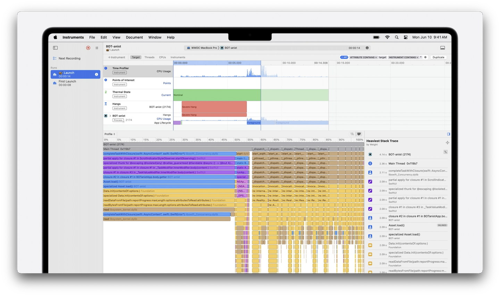

通过点击下图的按钮开启火焰图：

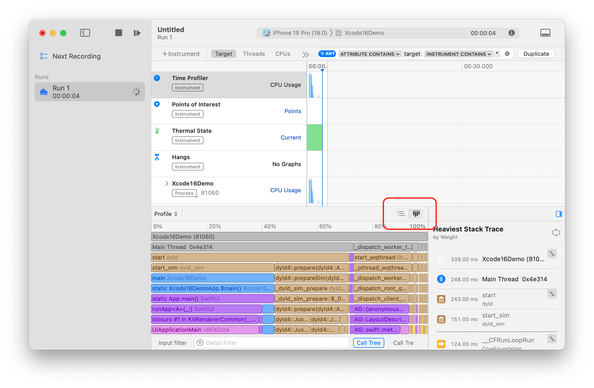

## 其他需要关注的更新

### 资源管理

为了适配 iOS 18 自定义图标样式，`iOS App Icon` 中新增可以配置深色模式和彩色图标样式。

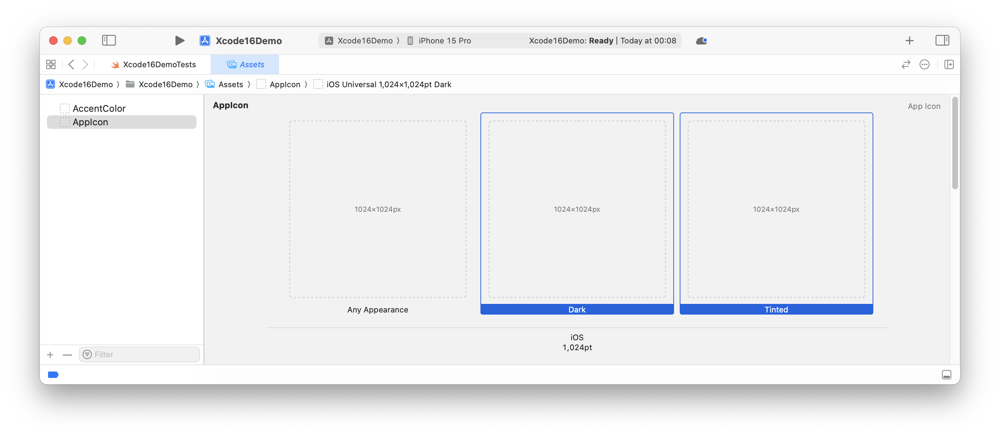

### 模拟器

visionOS 模拟器现在可以测试 FaceTime 和 SharePlay。

另外，现在 Xcode 包更小，目前 (Xcode 16 Beta 2) 下载大小由 Xcode 15.4(15F31d) 的 3.43GB 减小到 2.81 GB。并且在当模拟器下载遇到错误而中断时，现在可以恢复下载。

### @DebugDescription

举例说明，如下结构体，表示某个球队以及其输赢的场次，为了方便在调试时看到更多信息，为其实现 `CustomDebugStringConvertible` 协议，并定义我们想要的输出格式：

``` swift
struct Team: CustomDebugStringConvertible {
    var name: String
    var wins, losses: Int

    var debugDescription: String {
        "\(name) [\(wins)-\(losses)]"
    }
}
```

让我们来对比一下增加 `@DebugDescription` 前后有什么区别，将 Team 代码复制两份，一个为不使用宏修饰的 `TeamA`，另外一个为 `TeamB` 使用该宏进行修饰。

```swift
struct TeamA: CustomDebugStringConvertible {
    ...
}

@DebugDescription
struct TeamB: CustomDebugStringConvertible {
    ...
}
```

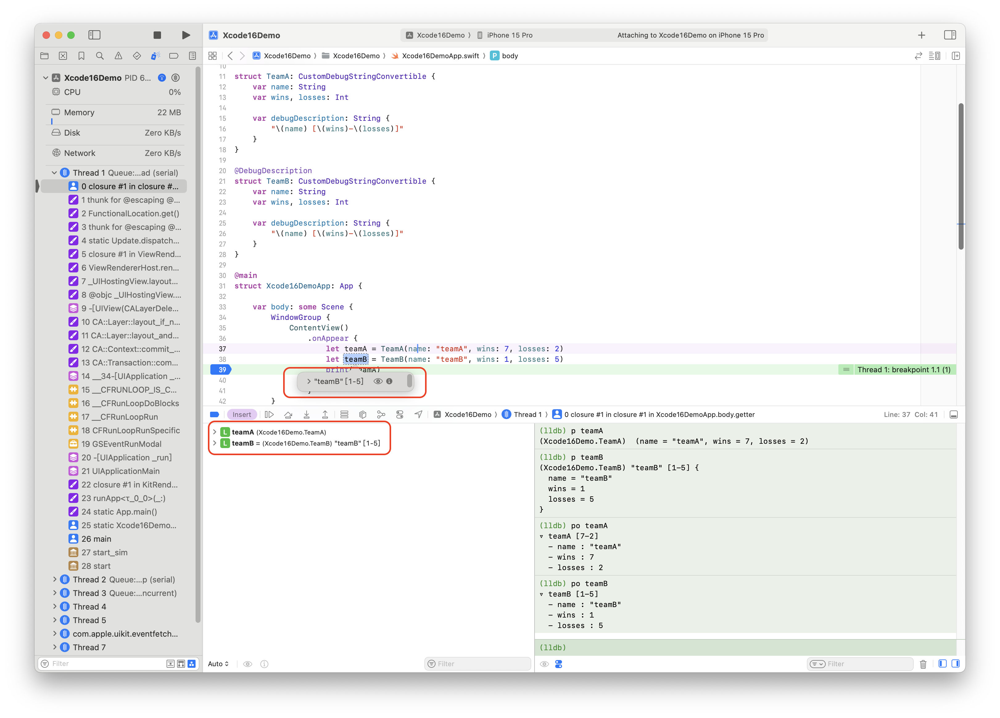
如图，可见 `@DebugDescription` 宏将兼容的 Swift 属性转换为 LLDB 类型摘要描述，可以让我们更直观地看到我们自定义的描述内容，而不用进行 `p` / `po` 命令。

另外， `@DebugDescription` 不仅仅支持 `CustomDebugStringConvertible` 还支持 `CustomStringConvertible`。更有意思的是，假设我们并不想用这两个协议，或者这两个协议都各自有额外的用途，我们还有第三个选择，直接提供名字为 `_debugDescription` 的属性：

```swift
@DebugDescription
struct Team: CustomStringConvertible, CustomDebugStringConvertible {
    ...
    var _debugDescription: String {
        "\(name) [\(wins)-\(losses)]"
    }
}
```

这样 LLDB 的摘要会优选选择 `_debugDescription` 的值，非常有趣。

### 项目和工作空间

- 通过在 `Navigator` 中，右键点击 `New Empty File` 更快速地创建新 Swift 文件，而不需要从对话框中选择；
- 通过复制代码，并在 `Navigator` 中粘贴以快速创建新文件，或者右键点击时按住 `Option` 键，选择 `New File from Clipboard`；
- 右键项目文件夹选择 `Convert to Folder / Group` 可以将 `Group` 类型和 `Folder` 类型进行互相转换；
- 为了更好地管理项目，现在隐藏了 `New Group without Folder` 选项，需要按住 `Option` 键以显示。

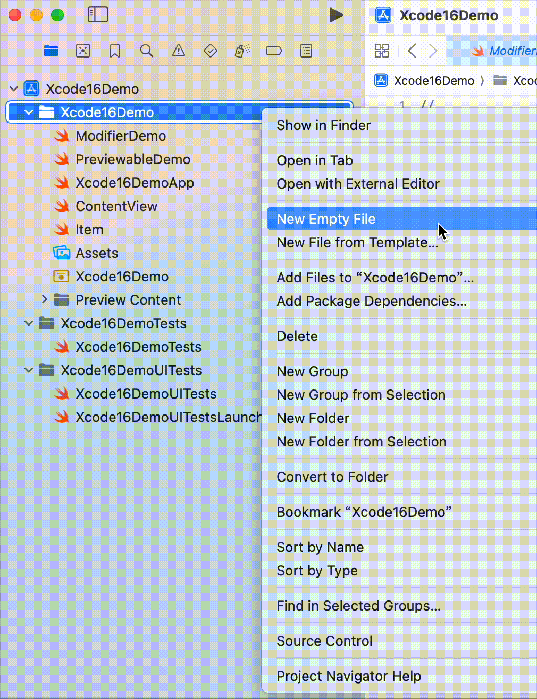

想要了解更多可以查看 [Xcode 16 Release Note](https://developer.apple.com/documentation/Updates/Xcode)，当然更好的办法是立刻下载 Xcode 16 来尝试一下 (注：目前还是 beta 版本，建议使用 [Xcodes App](https://github.com/XcodesOrg/XcodesApp) 进行多版本 Xcode 的管理，以免对正常开发产生影响)。

## 总结

虽然 Xcode 总有不尽如人意的地方，但是每年也都在努力变得更智能，更快速，更好用。不要忽视它，记得每年看看它更新的内容，相信你一定会从中找到能够改善开发体验或提升开发效率的技巧。

如今 Swift 迎来了它 10 周岁的生日，Swift 6 即将正式发布，近几年，苹果通过推出众多 Swift Only 的开发框架，以及越来越多的系统级应用使用 SwiftUI 重写，甚至今年提到的 Swift 在嵌入式设备上的开发，无疑是在不停的告诉我们 Swift / SwiftUI 就是未来。

经过多年的改进和完善，尤其是今年更严格的数据隔离和数据竞争安全检查，Swift 成为了一个运行效率高，开发效率高，安全性高，使用场景广泛的高级编程语言。虽然目前国内的开发环境，想使用 SwiftUI，SwiftData 等更现代化的编程框架可能会有一些阻力，但 Swift 语言本身的优秀程度和未来发展潜力非常值得我们投入。如果你还没有感受到 Swift 的优势，那么不妨从今年更安全的 Swift 6 开始，真正体验它的魅力吧！
