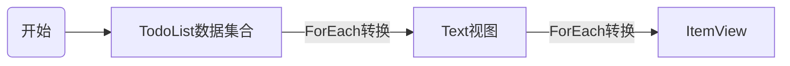
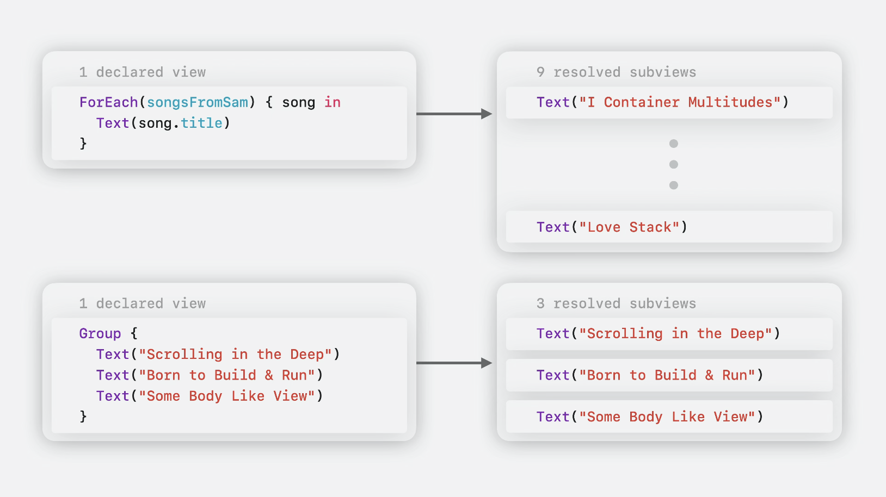
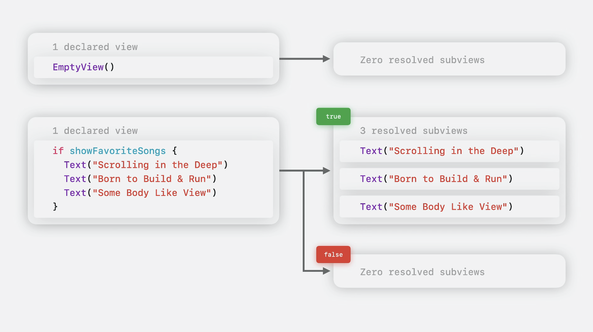
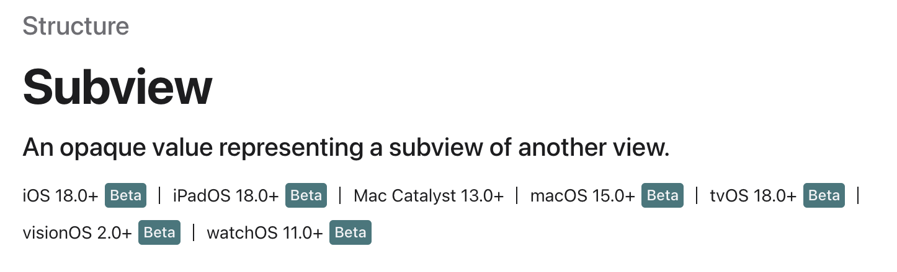
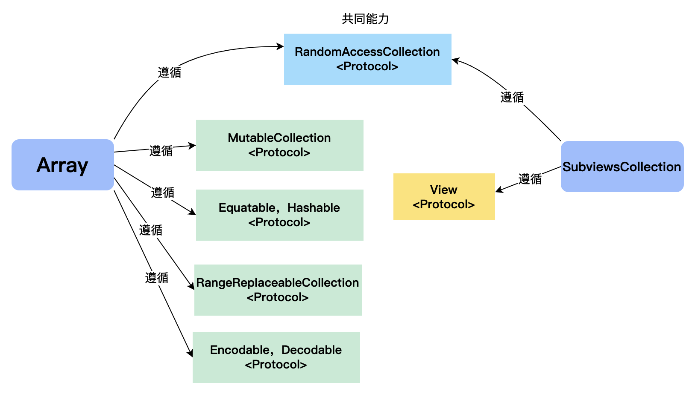
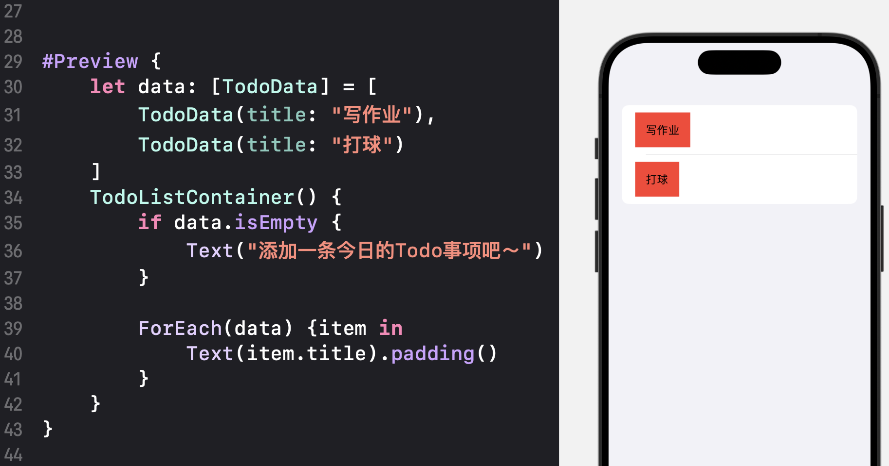
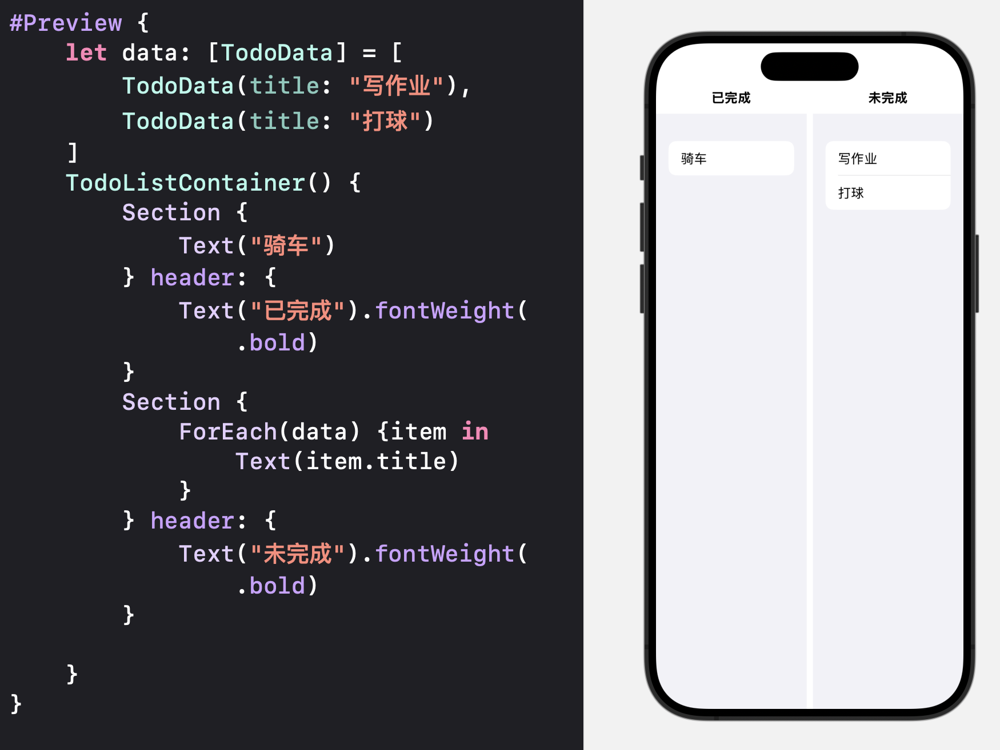
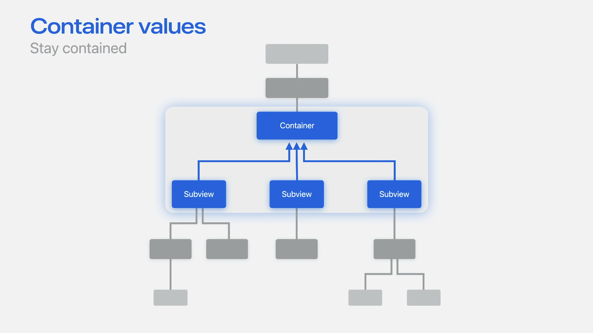
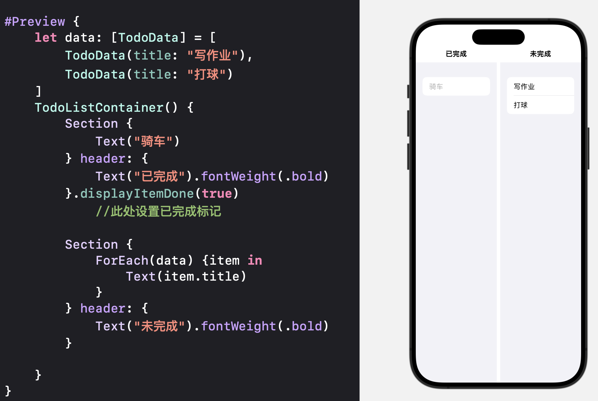
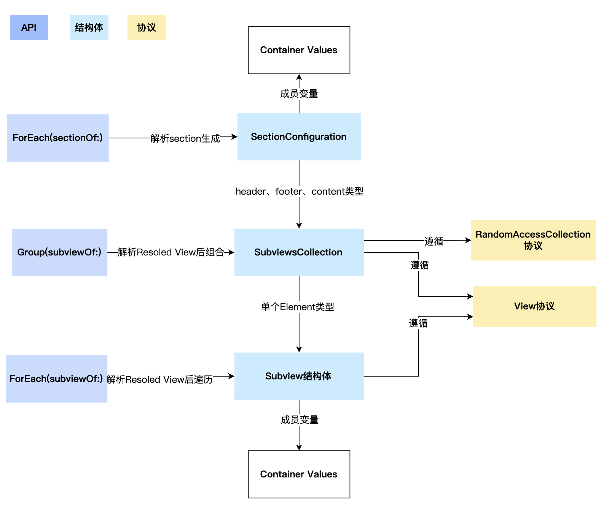

# # WWDC24: Session 10146 - Demystify SwiftUI containers

## 为自定义容器视图添加更多的能力

本文基于[Session 10146](https://developer.apple.com/videos/play/wwdc2024/10146/ "Session 10146")梳理

### 前言

在自定义容器中，我们一般会采取传入一个数据集合的方式来动态的填充容器内容，比如我有一个展示今日Todo事项的自定义容器`TodoListContainer`，一般我会这么写:

```swift
let data = [
    TodoData(title: "写作业"),
    TodoData(title: "打球")
]

TodoListContainer(data: data) { item in
    Text(item.title)
}
```

而在`TodoListContainer`的内部实现里，我将`Text`转换成`ItemView`

```swift
// TodoListContainer内部实现

var data: Data
    @ViewBuilder let content: (Data.Element) -> Content
    
    var body: some View {
        List {
            ForEach(data) { item in
                ItemView {
                  content(item)
              }
            }
        }
    }
```

这是一种我们常用的方式，通过这种方式我们可以通过数据集合动态的为视图容器填充内容。整个流程是这样的



那如果我希望在容器里同时也能展示一些静态的内容呢？比如像SwiftUI 提供的 `List`容器一样：

```swift
List {
//静态内容
  Text("Scrolling in the Deep")
  Text("Born to Build & Run")
  Text("Some Body Like View")

//动态内容
  ForEach(otherSongs) { song in
    Text(song.title)
  }
}
```

想象一个场景，假设我希望在用户没有添加任何数据的时候，为用户的列表里添加一条示范性的Todo Item，用户点击它可以进行修改。而当用户已有数据的时候，则不展示这条示范性的Todo Item。

面对这样的需求，常见的做法就是当数据集合中没有数据的时候，往数据集合中添加一条Fake Item。而如果自定义容器有可以像List容器那样的灵活性，我就可以在容器初始化的时候传入这条示范性的Todo Item，而不是往数据集合中添加Fake data。

接下来，我们会使用新的API来添加这样的能力。


那我就可以写成

```swift
TodoListContainer {
//没有数据时展示示范性的todoItem
  if todoLists.empty {
    TextView("添加一条今日的Todo事项吧～")    
  }

//正常展示
  ForEach(data) { item in
    TextView(todoData)    
  }
}
```


### 新增API  ForEach(subviewOf:)&#x20;

新的`ForEach(subviewOf:)` API 能够对视图的Subview进行遍历，并对每一个Subview进行处理。

通过这个新API，我们可以修改我们的代码，来实现我们刚刚设想需求：在没有数据的时候，添加一条静态数据，并且不是通过在传入的数据集合中添加Fake Data的方式。

我们将入参改为一个取名`content`的`ViewBuilder`，并使用`ForEach(subviewOf:)`在内部对content的Subview进行处理

```swift

// TodoListContainer 内部实现
@ViewBuilder let content: Content
var body: some View {
    List {
        ForEach(subviewOf: content) { subview in
            ItemView {
                subview
            }
        }
    }
}


```

最后我们修改一下调用逻辑，在`ViewBuilder`中加入“没有数据时展示示范性的TodoItem”的逻辑即可。

```swift
// 使用TodoListContainer
TodoListContainer {
//没有数据时展示示范性的todoItem
  if data.isEmpty {
    TextView("添加一条今日的Todo事项吧～")    
  }

//正常展示
  ForEach(data) { item in
    TextView(todoData)    
  }
}
```


### 新增API Group(subviewOf:)

相比 `ForEach(subviewOf:)`，新的`Group(subviewOf:)` API不会对所有Subview进行遍历，只会把所有的Subview组成一个集合。

比如我们希望在容器的最后添加一条“共有x条数据”的提示，那么就正好可以通过这个新API来获取到传入的 Subview 的个数并进行相应的逻辑处理

```swift
@ViewBuilder let content: Content
var body: some View {
    List {
        Group(subviewsOf: content) { subviewList in
            ForEach(subviewOf: content) { subview in
                ItemView {
                    subview
                }
            }
            ItemView {
                // 获取subview的数量并展示
                Text("共有\(subviewList.count)条数据")
            }
        }

    }
}
```

`ForEach(subviewOf:)` 和 `Group(subviewOf:)`这两个新API大大加强了我们在 SwiftUI 中对 Subview 的操控能力，使得更多的UI逻辑可以在SwiftUI中直接完成。


### Declared View 和 Resolved View以及SubView结构体

对这两个新API，大家一定会想了解更多，比如大家一定好奇`ForEach(subviewOf:)` 和 `Group(subviewOf:)` 是如何运作的，会对什么 样的Subview生效？`Group(subviewOf:)` 所返回的Subview数组是什么类型，可以用来做什么？

苹果这次提出了`Declared View`和`Resolved View`的概念，我理解 Declared 指的是声明的 View，而Resolved则指的是最终解析出来用来真正展示的View。比如声明的ForEach，Group这些`Declared View`，最终会解析出他们真正包含的View，里面可能是`Text`、`Image`之类的。苹果也给出了一些示例来解释什么是`Declared View`和`Resolved View`






而`ForEach(subviewOf:)` 和 `Group(subviewOf:)` API所处理的Subview指的正是`Resolved View`，也就是解析后的Subview。


我们看看`ForEach(subviewOf:)`的源代码：

```swift
extension ForEach{
    public init<V>(subviewOf view: V, 
    @ViewBuilder content: @escaping (Subview) -> Content))
}

```

其`ViewBuilder`闭包的类型是 `(Subview) -> Content`，没错，这次苹果新添加了一个取名为`Subview`的新结构体，它遵循`View`和 `Identifiable` 协议




而在`Group(subviewOf:)`中，其`ViewBuilder`闭包的声明是`@ViewBuilder transform: @escaping (SubviewsCollection) -> Result)`，也就是说这个API返回了一个`SubviewsCollection`的类型，我们仔细看一下`SubviewsCollection`的一部分声明

```swift
public struct SubviewsCollection : RandomAccessCollection {
    // 数据类型
    public typealias Element = Subview
    public typealias SubSequence = SubviewsCollectionSlice
    public typealias Index = Int
    public typealias Indices = Range<Int>

    // Method
    public subscript(index: Int) -> Subview { get }
    public subscript(bounds: Range<Int>) -> SubviewsCollectionSlice { get }
    ...
}


```

我们发现这个新的结构体`SubviewsCollection`遵循`RandomAccessCollection`协议，也就是和我们常用的`Array`有一部分同样的能力，但同时也有不同的能力，比如`SubviewsCollection`还遵循了`View`协议。通过`SubviewsCollection`我们可以对容器里的视图作进一步的操作，这里我们用一张图来比较一下它和Array能力上的差异



在`SubviewsCollection`中，`SubSequence`类型则是和`ArraySlice`类似的`SubviewsCollectionSlice`，而`Element`类型正是刚刚介绍的`Subview`结构体。

Apple在文档中特别指出这个`Subview`是真实展现的`Resolved View`的一个Proxy，`modifier`在它上面的应用会晚于原视图。我们可以写点代码专门验证一下。

首先我们在TodoListContainer的内部实现中，对`Subview`应用background(.red)来设置背景颜色。然后在外部调用时对原视图`Text`添加padding。

```swift
// TodoListContainer 实现
struct TodoListContainer<Content: View>: View  {
    @ViewBuilder let content: Content
    var body: some View {
        List {
            ForEach(subviewOf: content) { subview in
                ItemView {
                    // 设置背景颜色
                    subview.background(.red)
                }
            }
        }
    }
}

#Preview {
    let data: [TodoData] = [
        TodoData(title: "写作业"),
        TodoData(title: "打球")
    ]
    TodoListContainer() {
        if data.isEmpty {
            Text("添加一条今日的Todo事项吧～")
        }
        
        ForEach(data) {item in
             // 此处设置padding
            Text(item.title).padding()
        }
    }
}


```



最后的效果验证了的确是先应用了padding，再应用了设置background。`Subview`应用modifer晚于原视图。


### 新API ForEach(sectionOf:)

这次更新中还新添加了`ForEach(sectionOf:) `API，这个API顾名思义，是用来处理`ViewBuilder`中传入的`Section`的，在之前除了SwfitUI官方的容器之外，是没有办法处理`Section`的，而在这个API加入之后，自定义容器也有了处理`Section`的能力。

我们看看这个API

```swift
extension ForEach {
  public init<V>(sectionOf view: V, 
                 @ViewBuilder content: @escaping (SectionConfiguration) -> Content)
}

```

这个API的`ViewBuilder`闭包, 会返回一个`SectionConfiguration`的结构体

```swift
public struct SectionConfiguration : Identifiable {
    public var containerValues: ContainerValues { get } // ContainerValues后面会介绍
    public var header: SubviewsCollection { get }
    public var footer: SubviewsCollection { get }
    public var content: SubviewsCollection { get }
}
```

可以看出，从`SectionConfiguration`中我们可以获得`Section`中`header`、`footer`、`content`和`containerValues`信息, 由于`SubviewsCollection` 遵循 `View`协议，因此可以直接拿来用以展示，而`containerValues`我们在后面会介绍到。通过使用这个API，我们就可以为自定义容器添加处理`Section`的能力。

我们修改一下TodoListView的实现

```swift
// TodoListContainer 实现
@ViewBuilder let content: Content
var body: some View {
    HStack {
        ForEach(sectionOf: content) { sections in
        // 遍历Section
            VStack {
                // 展示Section的Header
                sections.header
                // 展示Section的内容
                List {
                    ForEach(subviewOf: sections.content) { subview in
                        ItemView {
                            subview
                        }
                    }
                }
            }
        }
    }
}
```

接下来我们传入`Section`信息，并设置`header`，便可以看到效果了




### ContianerValues

`Container Values`是一种新的数据存储框架，一个`Resolved View`的`Container Values`只能被它的直接容器所访问，因此它很适合被用来实现容器特定的自定义能力。容器可以通过`Subview`结构体或 `SectionConfiguration` 结构体来访问所存储的`Container Values`。

它和`Environment Values`以及`Preference Values`相似，但不同的是`Environment Values`会通过整个视图树向下传递，而`Preference Values`则会通过整个视图树向上传递。




我们可以尝试用`Container Values`给`TodoListContainer`添加把已完成的项目划掉的功能。首先，我们先创建一个`ContainerValues`的`Extension`，在其中添加我们的配置项

```swift
extension ContainerValues {
  @Entry var isTodoItemDone: Bool = false
}
```

在这个extension中，我会声明一个使用[@Entry 宏](https://developer.apple.com/documentation/swiftui/entry\(\)/ "@Entry 宏")标记的新属性，它存储了一个Bool值来跟踪卡片是否被划掉。

> 这个[@Entry 宏](https://developer.apple.com/documentation/swiftui/entry\(\)/ "@Entry 宏")是一个新的API，它提供了简便的语法来给SwiftUI的 存储添加新值，包括Environment Values，Focused Values等等。

下一步，我会声明一个自定义的`modifier`以方便设置我声明的`Container values` 值。这个`modifier`会将传入的值通过key path设置到`Container values`。

```swift
extension View {
  func displayItemDone(_ isDone: Bool) -> some View {
    containerValue(\.isTodoItemDone, isDone)
  }
}
```

最后我们在`TodoListContainer`的实现中读取这个Section`上`的`containerValues`，并传给`ItemView`，对于已完成的项目，`ItemValue`会降低透明度进行显示

```swift
  @ViewBuilder let content: Content
    var body: some View {
        HStack {
            ForEach(sectionOf: content) { sections in
                // 从section中读取containerValues
                let sectionValues = sections.containerValues
                VStack {
                    sections.header
                    List {
                        ForEach(subviewOf: sections.content) { subview in
                            ItemView(content: {
                                subview
                            }, isDone: sectionValues.isTodoItemDone)
                            // 将其中的是否完成的值传给ItemView；
                            // 若已完成，则会降低透明度显示
                        }
                    }
                }
            }
        }
    }
```

最后我们修改一下传入的代码，设置已完成的项目，并看看效果



已完成的骑车项目现在会用低透明度展示了。

> ContainerValues被规定为只能被直接父容器进行获取，这个直接父容器应该如何定义呢？苹果在文档中特别指出`Unlike preferences, however, container values don’t have merging behavior because they don’t escape their closest container.` 我们测试了一下，在`VStack`、`HStack`、`ZStack`这些包裹下，都无法在外部再获取到`Container Values`，但是在`Group`下却可以。

### 总结



我们总结一下本篇Session中所介绍的新添加的API吧。 `Group(subviewOf:)`和`ForEach(subviewOf:)`给了我们读取甚至操作UI的能力，而`ForEach(sectionOf:)`更是把Section能力带给了自定义容器，最后ContainerValue的加入，对于自定义容器的UI自定义提供了更方便的办法。

新添加的结构体`Subview`和`SubviewsCollection`则成为操控容器内视图的重要媒介，虽然它们的能力还没有特别多，但是相信苹果未来还会给它们添加更多的能力。

这些新的API大大加强了SwiftUI中操控UI的能力，而在这之前一些简单的UI逻辑我们都只能通过修改数据来使UI变化，而现在我们可以把更多逻辑放到UI里，使UI逻辑和业务逻辑更好的分离。预感到苹果未来应该会继续逐渐加强SwiftUI的操控UI能力，使得自定义的UI容器更加灵活和强大。
