# WWDC24: Session 10146 - Demystify SwiftUI containers

## 前言

Swift UI 在其 API 中提供了许多功能完备的容器。比如 List 容器，它可以使用尾视图构建闭包（Trailing View Builder Closure）来构建它们的内容。它允许以静态方式定义内容，就像这个包含硬编码内容的 List 容器

```swift
List {
  Text("Scrolling in the Deep")
  Text("Born to Build & Run")
  Text("Some Body Like View")
}
```


但也可以动态定义内容，例如使用 ForEach 视图根据数据集合生成文本视图，视图构建器支持在同一个容器内组合任何类型的内容。

```swift
List {
  Text("Scrolling in the Deep")
  Text("Born to Build & Run")
  Text("Some Body Like View")

  ForEach(otherSongs) { song in
    Text(song.title)
  }
}
```


它支持更高级的功能，例如将内容分组到具有可配置 Header 和 Footer 的不同 Section，以及针对容器进行定制的修饰符，就像在这个示例中我使用.listRowSeparator 隐藏了 List 视图每行之间的分隔符。

```swift
List {
  Section("Favorite Songs") {
    Text("Scrolling in the Deep")
    Text("Born to Build & Run")
    Text("Some Body Like View")
  }

  Section("Other Songs") {
    ForEach(otherSongs) { song in
      Text(song.title)
        .listRowSeparator(.hidden)
    }
  }
}
```


## 背景

正巧我最近刚接到了一个庆祝 WWDC 成功举行的卡拉 OK 的邀请，要回复请帖，我必须要提交我计划唱的歌曲名字，而我还没想好唱什么歌。

我打算使用 SwiftUI 的新 API 所带来的灵活性来帮助我解决这个问题。首先我会把我的想法都列在展示板(DisplayBoard)上。


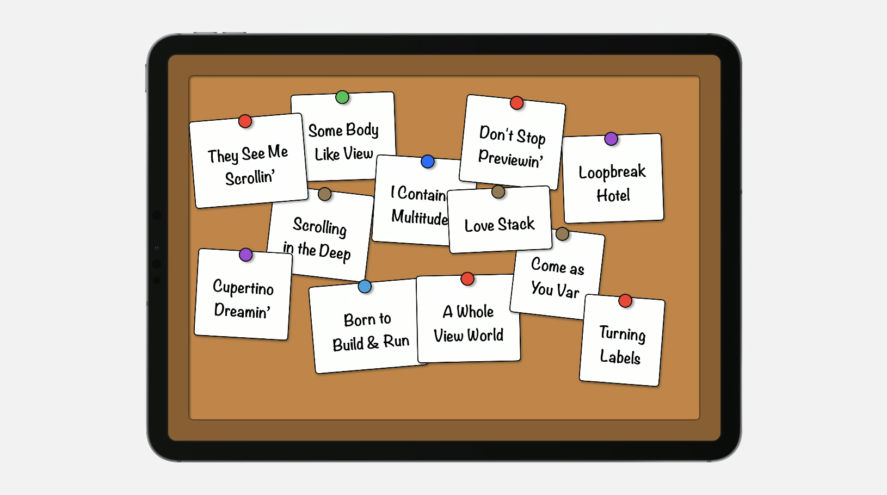


我初始化了一个 DisplayBoard 来展示我的歌曲选项集合，它会将我数据集合中的歌曲名字映射到 Text 视图上，而这些视图被写在卡片上并被钉在展示板（DisplayBoard）上。

```swift
// Data-Driven DispalyBoard

@State private var songs: [Song] = [
  Song("Scrolling in the Deep"),
  Song("Born to Build & Run"),
  Song("Some Body Like View"),
]

var body: some View {
  DisplayBoard(songs) { song in
    Text(song.title)
  }
}
```


而在 DisplayBoard 的代码实现中，我采用了自定义的样式，让卡片被随机地钉在整个 DisplayBoard 上。通过一个 ForEach 视图对数据集合进行遍历，通过每一项数据来初始化 CardView。

```swift
// DisplayBoard implementation

var data: Data
@ViewBuilder var content: (Data.Element) -> Content

var body: some View {
  DisplayBoardCardLayout {
    ForEach(data) { item in
      CardView {
        content(item)
      }
    }
  }
  .background { BoardBackgroundView() }
}
```

这是一个好的开始，但是我的 DisplayBoard 容器限制了我的创造，它只允许通过一个单一的数据集合进行构造。 ;

## Composition

我可以通过添加一些对更多种类的 Composition 的支持来使我的容器更加具有灵活性。但首先，我们得弄明白什么是 Composition。

想象一个 SwiftUI 的 List 视图，展示一串别人给我推荐的歌曲。这个 List 视图通过一个数据集合进行初始化，就像我的 DisplayBoard。

```swift
List(songsFromSam) { song in
  Text(song.title)
}
```


但是 SwiftUI 也支持用其他的方法创建 List。比如我可以手动编写一连串 Text 视图。

```swift
List {
  Text("Scrolling in the Deep")
  Text("Born to Build & Run")
  Text("Some Body Like View")
}
```


SwiftUI 通过提供新的 API 来将这两种方式结合在一起，新的 API 可以将两种内容进行组合。比如，我可以直接将两种方式结合起来初始化 List，这样一个组合的 List 就是一个 Composition 的例子。在同一个 List 中，我可以用硬编码方式静态的定义前三行内容，同时用数据集合动态的生成剩下的内容。

```swift
// List Composition

List {
  Text("Scrolling in the Deep")
  Text("Born to Build & Run")
  Text("Some Body Like View")

  ForEach(songsFromSam) { song in
    Text(song.title)
  }
}
```


### 新 API —— ForEach(subviewOf:)

我希望我的 DisplayBoard 容器也能够支持类似的灵活构建，为了达到这个目的，我需要修改我的实现。

第一步就是重构我的容器，使它可以通过一个 View Builder 来进行初始化。我将单一的数据集合参数替换成一个 ViewBuilder 视图对象。

通过添加这个 ViewBuilder 属性，我默认的初始化器可以自动的通过一个尾视图创建闭包来构建内容。

```swift
// DisplayBoard implementation

 @ViewBuilder var content: Content
 
var body: some View {
  DisplayBoardCardLayout {
    ForEach(data) { item in
      CardView {
        content(item)
      }
    }
  }
  .background { BoardBackgroundView() }
}

// Use Trailing View Builder Closure To Init DisplayBoard

DisplayBoard {
  Text("Scrolling in the Deep")
  Text("Born to Build & Run")
  Text("Some Body Like View")
}

DisplayBoard {
  ForEach(songsFromSam) { song in
    Text(song.title)
  }
}
```


接下来，我需要使用我的新的 content 视图来更新我的 view body，我可以通过使用一个新的 API：ForEach(subviewOf:), 这个 ForEach 视图接受一个单独的 view 作为输入参数，并返回 view 中的每一个 subview 给到 trailing closure。通过这样的方式可以将每一个 subview 转换成其他类型的视图，比如我的 CardView。

```swift
// Use New API: ForEach(subviewOf:)

@ViewBuilder var content: Content

var body: some View {
  DisplayBoardCardLayout {
     ForEach(subviewOf: content) { subview in
       CardView {
        subview
      }
    }
  }
  .background { BoardBackgroundView() }
}
```


最后我们更新 DisplayBoard 的初始化，传入之前用在 List 视图中的组合数据，将每一个 Text 视图转为 展示板上的 CardView。

```swift
// Update DisplayBoard Initializer

DisplayBoard {
  Text("Scrolling in the Deep")
  Text("Born to Build & Run")
  Text("Some Body Like View")

  ForEach(songsFromSam) { song in
    Text(song.title)
  }
}
```


这是一个巨大的进步，但是中间是如何运作的呢？。我们来仔细看看新 API ForEach(subviewOf:), 到底什么是 subview？ ;

一个 subview 简单的说就是被包含在另外一个 view 中的 view。看看代码，这里面有多少个 subview 呢？ ;

```swift
DisplayBoard {
  Text("Scrolling in the Deep")
  Text("Born to Build & Run")
  Text("Some Body Like View")

  ForEach(songsFromSam) { song in
    Text(song.title)
  }
}
```


这里面有 3 个 Text 视图和 1 个 ForEach 视图。但是 ForEach 视图不仅仅只是一个视图，它是一个包含了 9 个视图的集合。因此这里一共有 12 个视图，也就是有 12 个卡片展示在展示板上。

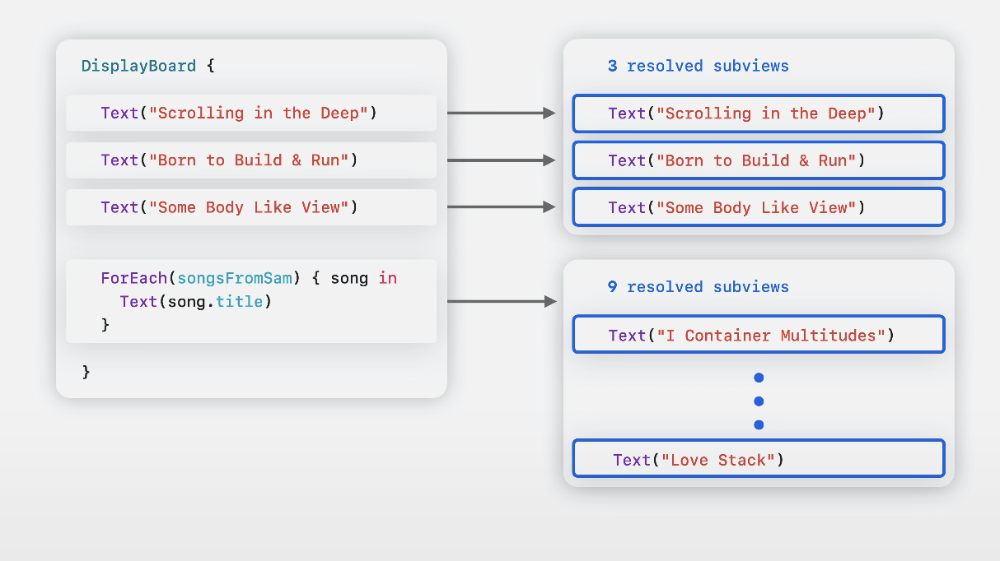


很重要的一点是要明白两种不同的 subview 的差异性。在 DisplayBoard 的初始化器中，用橙色方框标记出的是 Declared subview。 而用蓝色方框标记出来的，则是最终展现在屏幕上的 view，被称为 Resolved Subviews，其中包含 3 个手动声明的 Text 视图以及 9 个通过 ForEach 生成的 Text 视图。

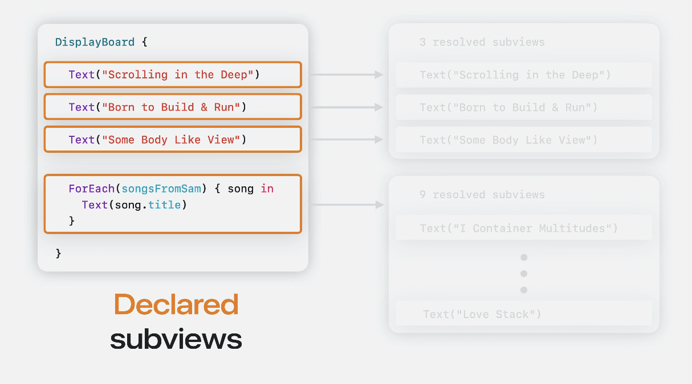

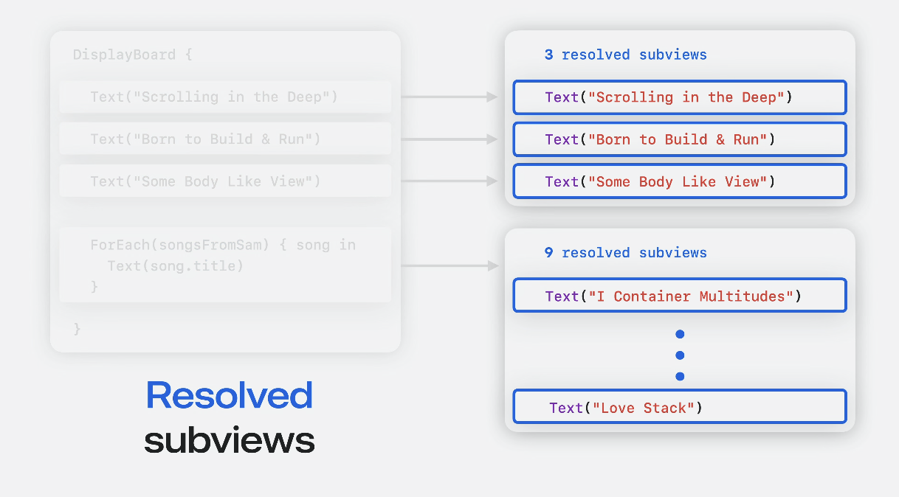


在 SwiftUI 的声明式系统中，Declared subviews 定义了生成 Resolved subviews 的配置。

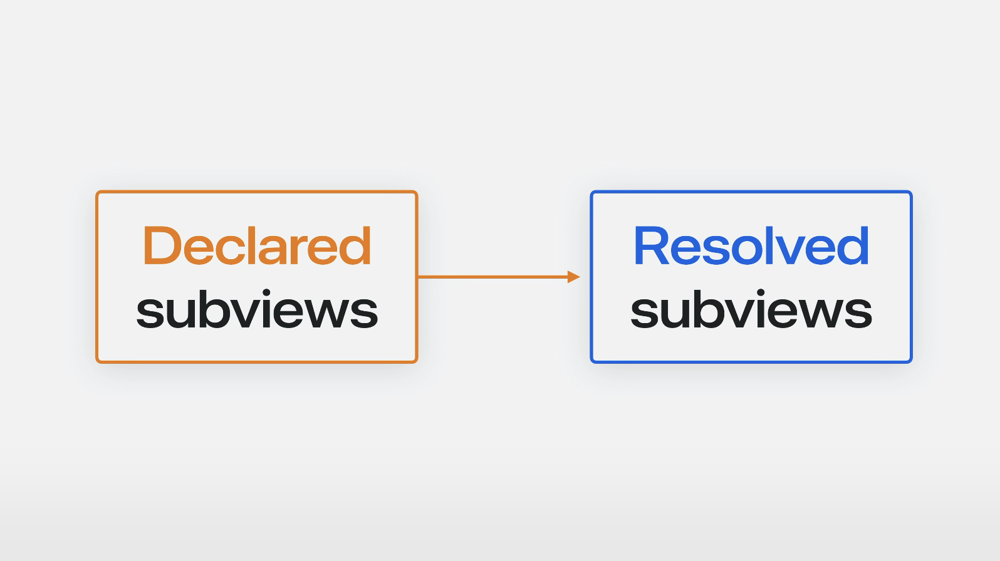


举个例，一个 ForEach 视图是一个并不会在界面上有任何具体展现或动作的 Declared subview。 但是，ForEach 视图的目的是生成一连串的 Resolved subview。

```swift
// 1 declared view
ForEach(songsFromSam) { song in
  Text(song.title)
}

// 9 resolved subviews
Text("I Container Multitudes")
…
Text("Love Stack")
```


Group 视图也是另外一个内建容器的例子，它包含了一连串 resolved subviews。 比如 一个包含了 3 个 Text 视图的 Group 视图，最终会解析为 3 个对应的 subview。

```swift
// 1 declared view
Group {
  Text("Scrolling in the Deep")
  Text("Born to Build & Run")
  Text("Some Body Like View")
}

// 3 resolved subviews
Text("Scrolling in the Deep")

Text("Born to Build & Run")

Text("Some Body Like View")
```


对于某些 declared subview，甚至可能产生 0 个 resolved subview，比如 EmptyView。或者在某些条件下会转换成不同数量的 subview，比如在不同的条件判断下。

```swift
// 1 declared view
EmptyView()  

// Zero resolved subviews
```


而新的 ForEach(subviewOf:)接口，会遍历其中所有的 Resolved subview。这使得我的容器可以支持任意的视图内容，不管 subview 是如何声明的，SwiftUI 都会将其转为 Resovled subview 进行处理。


### 新 API —— Group(subviewsOf:)

支持灵活的视图构成，使得添加新的歌曲到面板上非常容易。除了 Sam 的歌曲外，Sommer 也慷慨地推荐了一些她喜欢的歌。我可以用另外一个 ForEach 来添加她推荐的歌曲。

```swift
DisplayBoard {
  Text("Scrolling in the Deep")
  Text("Born to Build & Run")
  Text("Some Body Like View")

  ForEach(songsFromSam) { song in
    Text(song.title)
  }

  ForEach(songsFromSommer) { song in
    Text(song.title)
  }
}
```


现在我们发现，这个展示板已经有点拥挤了。

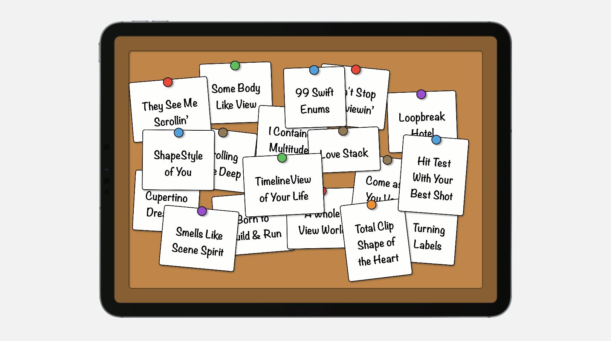


我想在卡片数量超过 15 个的时候，缩小卡片的大小。为了计算卡片数量，我们可以使用另外一个新 API：Group(subviewsOf:),  我们可以在代码中用它包裹住 ForEach。就像 ForEach(subviewOf:)一样, 它也会通过传入一个 view 来解析出他的所有 subviews。 Group(subviewsOf:) 会返回一个包含了所有 Resolved subview 的集合，而不是进行遍历。

```swift
// Use New API: Group(subviewsOf:)

@ViewBuilder var content: Content

var body: some View {
  DisplayBoardCardLayout {
     Group(subviewsOf: content) { subviews in
       ForEach(subviews) { subview in
        CardView {
          subview
        }
      }
    }
  }
  .background { BoardBackgroundView() }
}
```


接下来我就可以使用集合的 count 属性来检查 subview 视图的总数，以在其数量超过 15 个的时候，缩小卡片视图的大小。

```swift
@ViewBuilder var content: Content

var body: some View {
  DisplayBoardCardLayout {
    Group(subviewsOf: content) { subviews in
       ForEach(subviews) { subview in
         CardView(
           scale: subviews.count > 15 ? .small : .normal
         ) {
          subview
        }
      }
    }
  }
  .background { BoardBackgroundView() }
}
```


完成代码后当我再次运行 app，卡片缩小了也更加易读了。但还是感觉有点凌乱，所以下一步我们会添加对 Section 的支持。

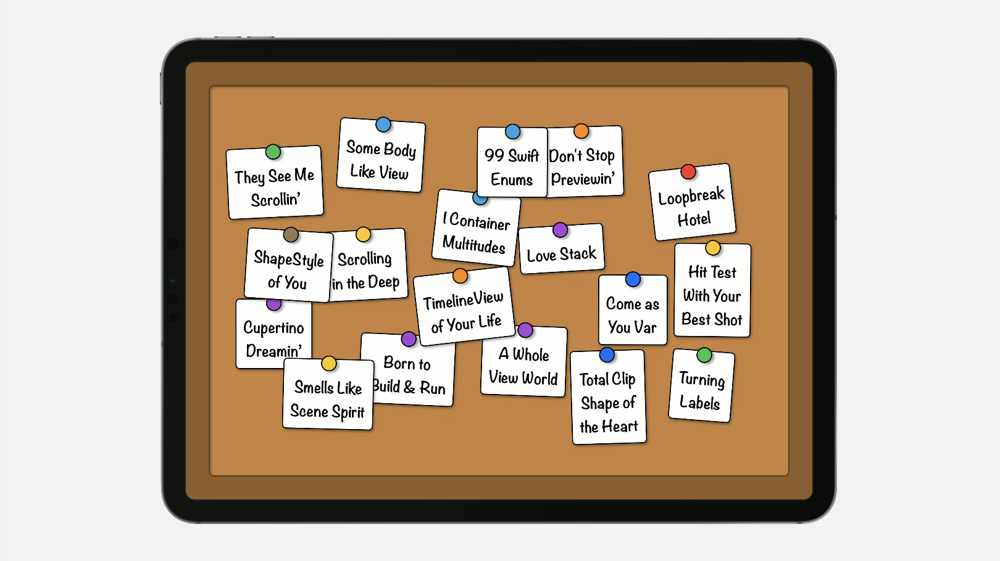

****

## Sections

List 是一个支持 Setion，使用 SwiftUI 的 Section 视图的典型容器。一个 Section 视图很像一个 Group 视图，但有着更多的 section 特定的数据，比如可选的 header 和 footer。

```swift
List {
  Section("Favorite Songs") {
    Text("Scrolling in the Deep")
    Text("Born to Build & Run")
    Text("Some Body Like View")
  }

  Section("Other Songs") {
    ForEach(otherSongs) { song in
      Text(song.title)
    }
  }
}
```

对于我的 DisplayBoard，我的目标是为每一个人推荐的歌曲创建一个单独的 section。 但是自定义的容器默认并不支持 section，因此我需要做一些多余的工作。

```swift
// Custom Container do not support Section for now
DisplayBoard {
  Section("Matt's Favorites") {
    Text("Scrolling in the Deep")
    Text("Born to Build & Run")
    Text("Some Body Like View")
  }
  Section("Sam's Favorites") {
    ForEach(songsFromSam) { song in
      Text(song.title)
    }
  }
  Section("Sommer's Favorites") {
    ForEach(songsFromSommer) { song in
      Text(song.title)
    }
  }
}
```


这是我预想的设计简图，将界面分割成 3 个垂直的 Section，而 Header 展示在每个 Section 最上面。

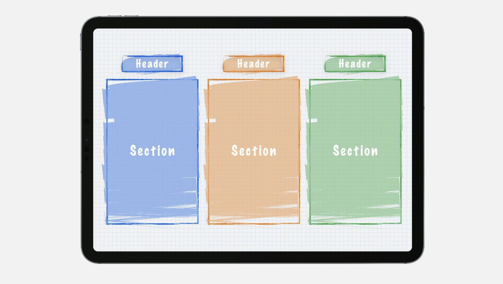


在我的实现中，首先我会将现有的卡片视图的样式逻辑抽离出去。

```swift
// DisplayBoard Implemention

@ViewBuilder var content: Content

var body: some View {
   DisplayBoardSectionContent {
    content
  } 
  .background { BoardBackgroundView() }
}

 struct DisplayBoardSectionContent<Content: View>: View {
  @ViewBuilder var content: Content
  ...
}
```


### 新 API —— ForEach(sectionOf:)

下一步，为了将展示板分成多列，我会用 HStack 包裹 Section 的内容。为了构建这些列，我需要访问每个 Section 的内容。为了达到这个目的，我们可以使用 ForEach 的新 API：ForEach(sectionOf:). 它和 ForEach(subviewOf:)类似，接受一个 view 作为传入参数。

而在这个 API 中，它会遍历所有传入的 view 中的 Section 视图，传递 Section 配置给他的 view builder 闭包。每一个 Section 都有一个它的 content 视图的属性，我可以将它传给之前抽离出的工具方法。

```swift
// Use New API: ForEach(sectionOf:)
@ViewBuilder var content: Content

var body: some View {
   HStack(spacing: 80) {
     ForEach(sectionOf: content) { section in
      DisplayBoardSectionContent {
        section.content
      }
    }
  }
  .background { BoardBackgroundView() }
}
```


最后再进行一些润色，给每一个 Section 添加一个背景，使他们能够视觉上区分开来。

```swift
@ViewBuilder var content: Content

var body: some View {
  HStack(spacing: 80) {
    ForEach(sectionOf: content) { section in
      DisplayBoardSectionContent {
        section.content
      }
       .background { BoardSectionBackgroundView() }
     }
  }
  .background { BoardBackgroundView() }
}
```

再次运行 app，通过 section 现在我可以更好的辨识出各种卡片了。接下来我要添加对 section header 的支持。


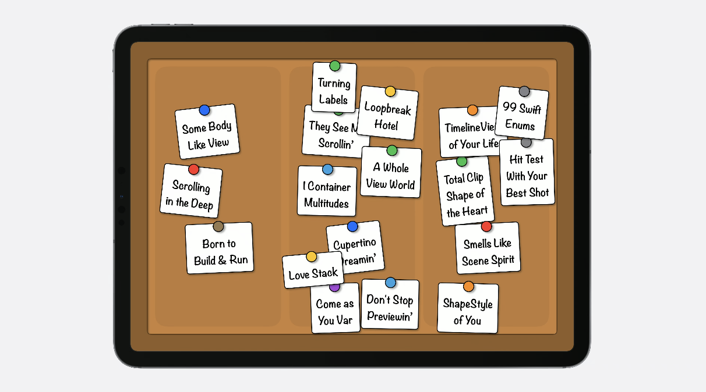


我会首先把每一个 Section 用 VStack 包裹，并添加 Header 和内容样式。接下来，通过 isEmpty 属性，我可以判断这个 Section 是否需要展示 Header。如果需要展示 Header，那么他会展示一个我之前写的自定义 Header 视图。

```swift
@ViewBuilder var content: Content

var body: some View {
  HStack(spacing: 80) {
    ForEach(sectionOf: content) { section in
      VStack(spacing: 20) {
         if !section.header.isEmpty {  // 检查是否要展示Header
          DisplayBoardSectionHeaderCard { section.header }  // 展示自定义的Header视图
        } 
         DisplayBoardSectionContent { 
          section.content
        }
        .background { BoardSectionBackgroundView() }
      }
    }
  }
  .background { BoardBackgroundView() }
}
```

再重新跑 App，现在每一个 Section 上方都有一个 Header 视图了。

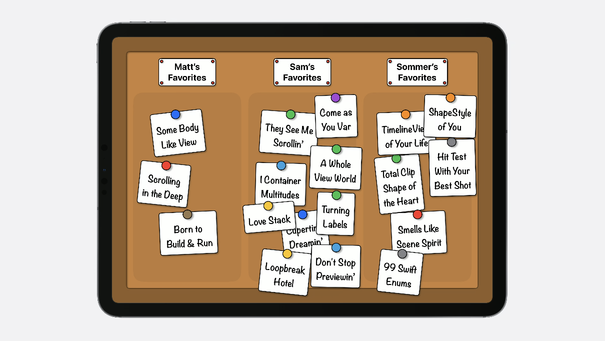


## Customization

为了开始选一首歌，我需要能够划掉我舍弃的选项。我可以通过修改我的容器来支持这样的能力。在前言里，我展示了一个使用.listRowSparator() modifier 的例子。即使这个 modifier 是应用于这个 List 中的一个视图，这个 List 容器自身也有义务实现在每行之间添加分割线的样式。

```swift
List {
  Section("Favorite Songs") {
    Text("Scrolling in the Deep")
    Text("Born to Build & Run")
    Text("Some Body Like View")
  }

  Section("Other Songs") {
    ForEach(otherSongs) { song in
      Text(song.title)
        .listRowSeparator(.hidden)
    }
  }
}
```

在 DisplayBoard 中，我想添加能够把我不想要的歌曲划掉的功能。有一个新的 API 专门用于建设这类容器专有能力的 modifier，被称为 Container Values.


### New API —— Container Values

Container Values 是一种新的 Key-Value 存储，在概念上和 Environment 和 Preferences 很类似。

但是和 Environment Values 不同在于，Environment Values 会通过整个视图树向下传递。

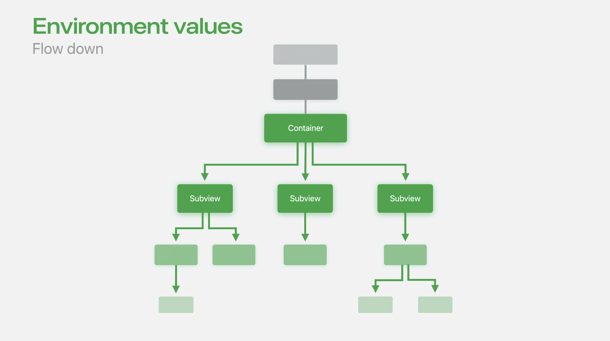


而 Preference Values，则会通过整个视图树向上传递。

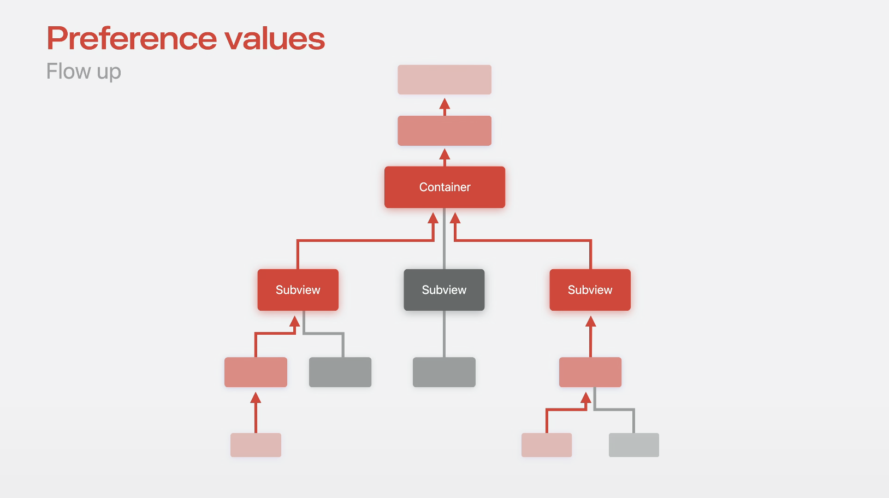


一个 Resolved Subview 的 Container Values 只能被它的直接容器所访问，这使得 Container Values 成为理想的工具来实现容器特定的自定义能力。


在我的 DisplayBoard 中，我会使用 Container Values 去创建一个自定义的视图 modifier 来划掉卡片。定义一个新的 Container Value 只需要几行代码。

第一步，我会创建一个 ContainerValues 的 extension，这是一个 SwiftUI 的新类型。

```swift
// Declare Container value

extension ContainerValues {
  @Entry var isDisplayBoardCardRejected: Bool = false
}
```

在这个 extension 中，我会声明一个使用[@Entry 宏](https://developer.apple.com/documentation/swiftui/entry\(\)/ "@Entry 宏")标记的新属性，它存储了一个 Bool 值来跟踪卡片是否被划掉。

这个[@Entry 宏](https://developer.apple.com/documentation/swiftui/entry\(\)/ "@Entry 宏")是一个新的 API，它提供了简便的语法来给 SwiftUI 的 存储添加新值，包括 Environment Values，Focused Values 等等。

下一步，我会声明一个自定义的视图 modifier 以方便设置我声明的 container value 值。这个 modifier 会将传入的值通过 key path 设置到 container value。

```swift
extension View {
  func displayBoardCardRejected(_ isRejected: Bool) -> some View {
    containerValue(\.isDisplayBoardCardRejected, isRejected)
  }
}
```


好了，现在我会给我的容器添加这个能力。在我们 Section 的实现中，我需要给我自定义的 CardView 添加 isRejected 参数来表明这个内容是否被拒绝。而通过新添加的 Container Values 属性我可以达到这样的目的，Container Values 的属性可以通过 Resolved subview 或者 Sections 获取到。

我会将我自定义的值传到 CardView 的 isRejected 参数中，当 CardView 的 isRejected 是 true 时，CardView 会显示一个自定义的划掉样式。

```swift
struct DisplayBoardSectionContent<Content: View>: View {
  @ViewBuilder var content: Content

  var body: some View {
    DisplayBoardCardLayout {
      Group(subviewsOf: content) { subviews in
        ForEach(subviews) { subview in
           let values = subview.containerValues 
          CardView(
            scale: (subviews.count > 15) ? .small : .normal,
             isRejected: values.isDisplayBoardCardRejected 
          ) {
            subview
          }
        }
      }
    }
  }
}
```

通过这个 Modifier，我就可以实现我划掉歌曲的能力。 我虽然喜欢歌曲*Scrolling in the Deep*，但我不确定我能唱得好，因此我划掉它。这个时候在 DisplayBoard 上就会展示一个大大的红色斜杠。

Sam 优先选择了一些歌曲，所以我也会划掉这些 Sam 已选则的歌曲。

而对于 Sommer，我不太确定他打算唱什么，所以为了保险起见，我会划掉所有他的歌曲。通过将 modifier 应用到整个 section，这个 section 下的所有 subview 都会被设置这个值。也就是所有 Sommer 的歌曲都被划掉了。

```swift
DisplayBoard {
  Section("Matt's Favorites") {
    Text("Scrolling in the Deep")
       .displayBoardCardRejected(true)  // 划掉我唱不好的歌曲
     Text("Born to Build & Run")
    Text("Some Body Like View")
  }
  Section("Sam's Favorites") {
    ForEach(songsFromSam) { song in
      Text(song.title)
         .displayBoardCardRejected(song.samHasDibs) // 划掉Sam已决定唱的歌曲
     }
  }
  Section("Sommer's Favorites") {
    ForEach(songsFromSommer) { Text($0.title) }}}
  }
   .displayBoardCardRejected(true) // 对整个Section设置，划掉Sommer所有的推荐歌曲
 }
```

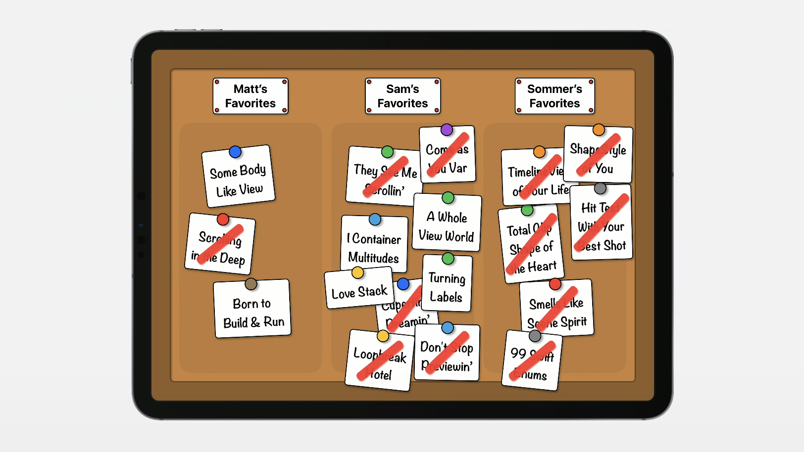


好的，我们已经朝着选到一首完美的卡拉 OK 歌曲迈进了一大步了，不过我还是要做出最终的选择。 在此期间，我们可以总结一下：

- 将 ForEach 和 Group 使用在初始化器上，去遍历，或者转换 Resolved subview 和 Section 视图
- 如果你的容器设计需要，那么你可以使用 Section 为其提供更多的能力
- 可以采用 Container Values 来自定义每一块单独的内容


